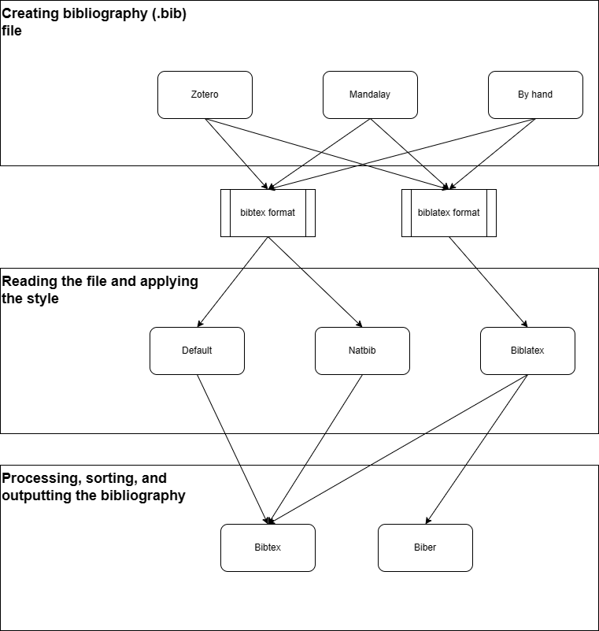

This manual covers the usage of the LaTeX language to typeset document. It is about the language itself and about ways how to achieve specific layouts/features.

For typography matter, see the [typography manual](https://github.com/F-I-D-O/typography/blob/master/main.pdf).

# Document structure
The document structure is well documented [on wikibooks](https://en.wikibooks.org/wiki/LaTeX/Document_Structure). The basic structure is:
```latex
\documentclass[<options>]{<class>}
...
\begin{document}
    ...
\end{document}
```

Lot of content is usually put in the preamble, i.e., between the `\documentclass` and `\begin{document}` commands. The preamble usual content is:

- loading packages with `\usepackage{<package>}`
- providing new commands or redefining existing commands
- configuring packages
- supplying metadata for the document (title, author, etc.)

## Title page
The title page typically contains the title, authors, and potentially other metadata like date or keywords. The standard way how to create the title page is to first define the metadata and then use the `\maketitle` command. To print the whole title page. The metadata available for standard article class:

- `\title{<title>}`
- `\author{<author>}`
- `\date{<date>}`. `\today` can be used to print the current date. This is the default value if we omit the `\date` command.

A special non-numbered footnote can be added to most fields using the `\thanks{<text>}` command. 

### Authors specification
By default, all authors should be filled within a single `\author` command, separated by the `\and` command. If we need to specify the affiliations, we can do it inside the `\author` command. This way, each author have the affiliation printed right after/bellow the author name. 

However, if there are many authors with shared affiliations, this approach is unsustainable. Instead, we can use the `authblk` package which lets us specify the authors and affiliations separately and connect them to authors using footnotes. Example:
```latex
\usepackage{authblk}

\author[1]{Author 1}
\author[2]{Author 2}
\author[1]{Author 3}

\affil[1]{Affiliation 1}
\affil[2]{Affiliation 2}
```

#### IEEE author list
In IEEE publications, all authors are usually listed in the same `\author` command. Also, the affiliations are inside this command, typically created using the `\thanks` command. Example:
```latex
\author{David Fiedler, Jan Mrkos, Dominika Šídlová, and Fabio V. Difonzo
\thanks{This work was supported by the Technology Agency of the Czech Republic within the DOPRAVA 2020+ program, project no. \texttt{CK04000150}. Fabio V.~Difonzo gratefully thanks the INdAM-GNCS group for partial support. The access to the computational infrastructure of the OP VVV funded project \texttt{CZ.02.1.01/0.0/0.0/16\_019/0000765} "Research Center for Informatics" is also gratefully acknowledged. \emph{(Corresponding author: David Fiedler.)}}
\thanks{D. Fiedler, J. Mrkos, and D. Šídlová are with Faculty of Electrical Engineering, CTU in Prague, Prague 121 35, Czech Republic (e-mail: david.fiedler@agents.fel.cvut.cz).}
\thanks{F. V. Difonzo is with Istituto per le Applicazioni del Calcolo "Mauro Picone", Consiglio Nazionale delle Ricerche, Bari 70126, Italy.}}
```


### Keywords
Keywords are not part of the standard article class. If we need to include them when using the standard article class, we can provide the command ourselves. Example:
```latex
\providecommand{\keywords}[1]{\textbf{\textit{Index terms---}} #1}
...
\keywords{keyword1, keyword2, ...}
```


## Appendices
Appendicies are started with the command `appendix`. Then, each chapter started with the `\chapter` command is considered an appendix. 


## Book class structuring
Appart from sections and chapters, the book class also supports top level parts for marking special areas of the document. The parts are:

- `\frontmatter`: the front matter of the document, i.e., the title page, abstract, table of contents, etc. The page numbering is in roman numerals.
- `\mainmatter`: the main matter of the document, i.e., the main content. The page numbering is in arabic numerals, and the page numbering is reset to 1.
- `\backmatter`: the back matter of the document, i.e., the bibliography, appendices, etc. The page numbering is in arabic numerals. Chapters are not numbered.


# Escape characters and commands
LaTeX uses many special characters which needs to be escaped. Unfortunatelly, there is no single escape character, instead, there are many. The following table lists the most common escape characters:

| Character | Escape sequence |
| --- | --- |
| `[` | `{[}` |
| `]` | `{]}` |

When we need to print \LaTeX commands, it is better to escape the whole command, not just the special characters. There are three ways how to escape the whole command: `\string<command>`, `\verb|<command>|`, and `\begin{verbatim}<command>\end{verbatim}`. The difference between the two are summarized in the following table:

| Command | spaces allowed | new lines allowed | can be used in floats  | automatically changes the font |
| --- | --- | --- | --- | --- |
| `\string` | no | no | yes | no |
| `\verb` | yes | no | no | yes |
| `\verbatim` | yes | yes | no | yes |


# Special characters

## Non-breaking characters

- `~`: non-breaking space
- `\nobreakdash-`: non-breaking dash


# Text and paragraph formatting
[wiki](https://en.wikibooks.org/wiki/LaTeX/Fonts)

## Fonts

### Determining used font
To determine the font (size, type) used in a particular place put the following command there:
```latex
\showthe\font
```
Then compile the document. The font information will be printed in the log (e.g.: `\OT1/cmr/m/n/10`).


### Changing font size
The default font size is `10pt`. To change the default font size, set the `documentclass` option `12pt` or `11pt` (other sizes are not avialable). See the [wiki](https://en.wikibooks.org/wiki/LaTeX/Document_Structure#Document_classes) for more information.

The size can be also changed for a specific part of the document. We can use some [predefined sizes](https://en.wikibooks.org/wiki/LaTeX/Fonts#Sizing_text) e.g.:
```latex
Normal {\tiny tiny} normal
```
or we can use the `\fontsize` command to set arbitrary size. Example:
```latex
{\fontsize{<size>}{<line spacing>}\selectfont <text>}
```


### Font color
[wiki](https://en.wikibooks.org/wiki/LaTeX/Colors)

To change the font color, we need to use the [`xcolor`](https://ctan.org/pkg/xcolor) package. 

First, we need to define the color using the `\definecolor` command. Example:
```latex
\definecolor{my_color}{RGB}{255,0,0} # RGB color
\definecolor{my_color}{HTML}{FF0000} # HTML color
\definecolor{my_color}{cmyk}{0,1,1,0} # CMYK color
```

Then, we can use various commands to change the font color:

- `\textcolor{<color>}{<text>}`: change the color of the text
- `{\color{<color>}<text>}`: change the color of the text. Can span multiple paragraphs.

note that other commands that have color options usually depend on the `xcolor` package, and accept the same color definitions.


## Horizontal and vertical spacing
Most of the time, the spacing should be handled by LaTeX automatically. However, there are cases when we need to adjust the spacing manually, either in a single place or globally. 

To adjust the spacing in a single place, we can use the following commands:

- `\hspace{<length>}`: horizontal space
- `\vspace{<length>}`: vertical space

Note that we can use negative values for the `<length>` parameter, so we can use these commands to relatively positioning.


## Horizontal and vertical alignment


### Horizontal alignment
[wiki](https://en.wikibooks.org/wiki/LaTeX/Paragraph_Formatting#Paragraph_alignment)

By default, the text is fully justified. To change the justification (alignment), to left or right, we can use either 

- environments: `flushleft` for left alignment, `flushright` for right alignment, or
- commands: `\raggedright` for **left** alignment, `\raggedleft` for **right** alignment.


### Vertical alignment
By default, the text starts from the top of the page. To align the text to the bottom of the page, we can use the `vfill` command. Example:
```latex
Some text
\vfill
Some text at the bottom
```


Note that the `vfill` works only if there is something before it, it does not work if it is the first command on the page. To make it work, we can use the `null` command. Example:
```latex
\null
\vfill
Some text at the bottom
```


## Line breaking
Latex handle the line breaking automatically. Typically, it breaks the line at the end of the word. Sometimes, it can break long words. 

To **prevent breaking long words**, we can use the `\mbox` command. Example:
```latex
\mbox{long word}
```

To **prevent breaking on spaces**, we can use the non-breaking space character: `~`.


## Subscript and superscript
In math mode, the subscript and superscript are created using the `_` and `^` characters. In text mode, we need to use a special commands: `\textsubscript` and `\textsuperscript`. Example:
```latex
H\textsubscript{2}O
```


## Lists
The list enviroments have the following syntax:
```latex
\begin{<list type>}
    \item <item 1>
    \item <item 2>
    ...
\end{<list type>}
```

The following list types are available:

- `itemize`: bullet points
- `enumerate`: numbered list
- `description`: description list. Items can have a label, which is specified as an optional argument of the `\item` command. 

More typoes of lists like questions or checklists can be created using external packages.


## Units, numbers, and currency with `siunitx`
Units are usually typeset with a small space between the number and the unit. Normal space should be avoidedas it is too wide. Also, we sometimes want a special separator in large numbers. For these purposes, the best practice is to use the [`siunitx`](https://ctan.org/pkg/siunitx) package. 

Eith `siunitx`, the units are typeset using the `\SI` command. Example:
```latex
\SI{10}{\meter}
```

The numbers should be typeset using the `\num` command. Example:
```latex
\num{1000000}
```

The currecnies that have the currency sign before the number are also typeset using the `\SI` command, but we need to use the optional argument for prefix:
```latex
\SI{10}[\$]{}
```

### `siunitx` `\per` problems
[SE thread](https://tex.stackexchange.com/questions/55895/per-kwh-produces-a-wrong-output)

To express a relation between two units we ofthe use the `/` symbol, which we can replace with the `\per` command when using `siunitx`. Example:
```latex
\SI{10}{\meter\per\second} % 10 m/s
```

However, the output is not always as expected:
```latex
\SI{10}[\$]{\per\kWH} % $10 h/kW 
```

The solution is to redefine the `\kWH` command:
```latex
\AtBeginDocument{\DeclareSIUnit{\kWh}{kWh}}

\SI{10}[\$]{\per\kWh} % $10/kWh
```


## Quotes
The quotes are typeset using the `csquotes` package. The quotes are typeset using the `\enquote` command. Example:
```latex
\enquote{This is a quote}
```


### Supported units

- `\s`: second
- `\km`: kilometer
- `\km\per\hour`: kilometer per hour
- `\percent`: percent


# Floats
The following environments are floats:

- `figure`
- `table`
- `algorithm`

## Placement
Any float takes the position as a first argument. The following positions are available:

- `h`: here
- `t`: top
- `b`: bottom
- `p`: special dedicated page per float
- `!`: ignore nice positioning and put it according to the float specifiers

The placement algorithm then iterate pages starting from the page where the float is placed. For each page, it tries to find a place for the float according to the float specifiers (in the same order as they appear in the float position argument). In case of success, the procedure stops and place the float. If the procedure fails for all pages, the float is placed at the end. 

Note that by specifying the float position, we only add constraints to the placement algorithm, but do not guarantee the placement. **By omitting the float position, we can accually make the float appear closer to the place where it is defined.**

Sources:

- [LaTeX Wikibook](https://en.wikibooks.org/wiki/LaTeX/Floats,_Figures_and_Captions#Figures)
- [Overleaf](https://www.overleaf.com/learn/latex/Positioning_images_and_tables#The_figure_environment)

### Default placement
The default placement differs between environments and also classes. For example for article class, the default placement for `figure` and `table` is `tbp` ([see SO](https://tex.stackexchange.com/questions/172782/what-are-the-default-placement-options-for-a-floating-figure-in-latex)).


## Figures
The float environment for figures is `figure`. The image itself is included using the `\includegraphics` command. 

The mandatory argument of the `\includegraphics` command is the path to the image file. This path can be relative or absolute. If the path is relative, it is relative to the location of the main `.tex` file. The file extension can be omitted. If the file extension is omitted, the compiler will try to find the file with various extensions. Therefore, it is only recommended to omit the file extension if there is only one file with the same name.

Optional arguments of the `\includegraphics` command are the following:

- `width`: the width of the image.
    - example: `\includegraphics[width=0.5\textwidth]{image.png}`
- `scale`: the scale of the image with respect to the original size.
    - example: `\includegraphics[scale=0.5]{image.png}`


### Subfigures
For more images in one float, we can use the `subfigure` environment from the [`subcaption`](https://ctan.org/pkg/subcaption) package. The `subfigure` environment is used as follows:
```latex
\begin{figure}[h]
    \centering
    \begin{subfigure}{0.3\textwidth}
        \includegraphics[width=\textwidth]{image1.png}
        \caption{Image 1}
        \label{fig:image1}
    \end{subfigure}
    \begin{subfigure}{0.3\textwidth}
        \includegraphics[width=\textwidth]{image2.png}
        \caption{Image 2}
        \label{fig:image2}
    \end{subfigure}
    \caption{My figure}
    \label{fig:my_figure}
\end{figure}
```
If the figures are not of the same height, they will be aligned at the bottom. To align them at the top, we can use the `T` option for the `subfigure` environment. Example:
```latex
\begin{subfigure}[T]{0.3\textwidth}
    ...
\end{subfigure}
```

## Tables
The float environment for tables is `table`. However, the rows and columns are wrapped in another environment. The default inner enviroment is `tabular`, however, there are *many* other packages that extends the functionality. In practice, there are currently three inner environments to consider:

- `tabular`: the default environment that is sufficient for simple tables
- `tabulary`: the environment that allows to create columns with automatic width. If the main or only issue of the table is that it needs to fit a specific width, this is the environment to use.
- `tblr`: the `tblr` environment from the [`tabularray`](https://ctan.org/pkg/tabularray) package is the most up to date tabular environment that support many features. Also, it splits the table presentation from the table content, which can make generating tables from code easier. The only downside is that **it does not support automatic column width**. 


### Column types
The column types are specified in the argument of the `tabular` or equivalent environment. The following column types are available by default:

- `l`: left aligned
- `c`: centered
- `r`: right aligned
- `p{width}`: paragraph column with specified width

Other column types can be provided by the inner environment package or by the user.


### Simple tables with tabular environment
The usual way to create a table in the `tabular` environment is:
```latex
\begin{table}[h]
    \centering % center the content of the table environment
    \begin{tabular}{|c|c|}
        ... rows and columns
    \end{tabular}
    \caption{My table}
    \label{tab:my_table}
\end{table}
```


### Columns with automatic width: `tabulary`
By default, laTeX does not support automatic width for columns, i.e., sizing the columns by their content. To enable this feature, we can use the `tabulary` package, which provides the `tabulary` environment (which is a replacement for the `tabular` environment). The columns with automatic width are specified by the `L`, `C`, `R` column types. 

Note that the new column types can be combined with the standard column types. In that case, the standard columns will have width according to their content, and the rest of the space will be distributed among the new column types. 


### Complex tables with `tabulararray` package
The `tabulararray` package provides :

- full control over the table, most features among all packages
- separation of the table content and the table presentation 
- simpler code for basic tasks like multirows and multicolumns, wrapping text in cells, etc.

Notable features present in the `tabulararray` package missing in other packages:

- footnotes in tables (otherwise, it requires a `threeparttable` environment wrapper)

As other tabular packages, there are some incompatibilities related to the `tabulararray` package.  So far, I observed only incompatibilities with the `tabulararray` `talltblr` environment, not with the standard `tblr` environment. The following table summarizes the incompatibilities I found so far:

- `cases`: Obviously, the `cases` environment uses table components internally. When using together with `talltblr`, the `cases` environment compilation results with the following error: `latex "\begin{cases}" package array empty preamble l' used`. The solution is to use the use the new `+cases` environment provided by the `tabulararray` package. As a bonus, the `+cases` environment also fixes some visual glitches. Steps:
    1. enable the `+cases` environment by adding `\UseTblrLibrary{amsmath}` to the preamble
    1. replace the `cases` environment with the `+cases` environment 
- `tabular`: yes, the `talltblr` environment is incompatible with the default `tabular` environment. The solution is simple: replace all `tabular` environments with `tblr` environments.


### Styling

#### Table grid (visual lines)
Usually, tables contain some horizontal and vertical lines to separate the cells. Unfortunately, the way how to create these lines differs completely between horizontal and vertical lines.

##### Horizontal lines
For horizontal lines, we can:

- use various commands to create a line in a specific row:
    - `\hline`: creates a line in the current row
- specify the lines outside the data with the `tabularray` package:
    
##### Specify the lines outside the data with the `tabularray` package
The format is `hline{<list of rows>} = {<line style>}`. Example:
```latex
\begin{tblr}{
    colspec={|c|c|c|},
    hline{1,Z} = {1pt, solid},
}
...
\end{tblr}
```
The `<list of rows>` can be specified as:

- single row: `hline{1} = {1pt, solid}`
- multiple rows: `hline{1,3,5} = {1pt, solid}`
- range of rows: `hline{1-Z} = {1pt, solid}`

Rows are numbered from 1. The `Z` character is used to specify the last row.


#### Styling the specific rows or columns
With the `tabularray` package, we can style the table header differently than the rest of the table. In fact, we can style each specific row or column differently. for that, we use the `row` and `column` keys. Example
```latex
\begin{tblr}{
    colspec={|c|c|c|},
    row{1} = {bg=gray9, fg=white},
    column{1} = {bg=gray9, fg=white},
}
```

The syntax is the same for both keys: `row{<row number>} = {<style>}`. For the `<row number>` specification, see the grid section. The `<style>` specification is a list of key-value pairs. The keys are the following:

- `font`: the font style


#### Configure the space between columns
In most packages, the space between columns is configured using the `\tabcolsep` variable. Example:
```latex
\setlength{\tabcolsep}{10pt}
```

However, in the `tblr` environment, the space between columns is configured using the `leftsep` and `rightsep` keys. Example:, 
```latex
\begin{tblr}
{
    colspec={llllrr},
    leftsep=2pt, 
    rightsep=2pt
}
```
By default, the `leftsep` and `rightsep` are set to `6pt`.


#### Define table styles with `tabularray` package
The `tabularray` package provides a way to define table styles. First, we define the new environment with the `\NewTblrEnviron` command. Later, we use the `SetTblrInner` and `SetTblrOuter` commands to define the style. Example:
```latex
\NewTblrEnviron{mytblr}{
    \SetTblrInner{rowsep=1pt}
    \SetTblrOuter{hspan=minimal}
}
``` 

#### Rotated text
To rotate some text, we can use the `\rotatebox` command:
```latex
\rotatebox{90}{Rotated text}
```


### Multirows and multicolumns
Depending on the inner environment, the multirows and multicolumns are created using different commands. 

#### `tabular` environment
In the `tabular` environment, the multirows and multicolumns are created using the `\multicolumn` and `\multirow` commands. Example:
```latex
\begin{tabular}{cc}
    \multicolumn{2}{c}{multi column} \\
    \multirow{2}{*}{multi row} & 1 \\
    & 2 \\
\end{tabular}
```

#### `tabulararray` environment
In the `tabulararray` environment, the multirows and multicolumns are created using the `\SetCell` command. Example:
```latex
\begin{tblr}{cc}
    \SetCell[c=2]{c} multi column & \\
    \SetCell[r=2]{c} multi row & 1 \\
    & 2 \\
\end{tblr}
```

Note that for multicolumns, **we need to add the column divider (`&`) after the `\SetCell` command for each column that is spanned by the multicolumn**. 

### Export google sheets to latex tables
There is ann addon called [LatexKit](http://caenrigen.tech/LatexKit/) which can be used for that.


### Footnotes in tables
In tables and table captions, the `\footnote` command does not work correctly. Also, it is not desirable to have the footnote at the bottom of page, instead, we want the footnote to be at the bottom of the table. To achieve this, we use a special environment:

- `threeparttable`: if we are using the `tabular` or `tabulary` environment
- `talltblr`: if we are using the `tblr` environment

#### Using the `threeparttable`
The `threeparttable` environment is used as follows:
```latex
\begin{table}[h]
    \centering
    \caption{My table}
    \label{tab:my_table}
    \begin{threeparttable}
        \begin{tabular}{|c|c|}
            one$^a$ & two$^b$ \\
            ... other rows and columns
        \end{tabular}
        \begin{tablenotes}
            \item $^a$footnote 1
            \item $^b$footnote 2
        \end{tablenotes}
    \end{threeparttable}
\end{table}
```

#### Using the `talltblr`
The `talltblr` environment is used as follows:
```latex
\begin{table}[h]
    \centering
    \caption{My table}
    \label{tab:my_table}
    \begin{talltblr}[
        label = none,
        note{a} = {footnote 1},
        note{b} = {footnote 2}
    ]{
        colspec={|c|c|},
    }
        one\TblrNote{a} & two\TblrNote{b} \\
        ... other rows and columns
    \end{talltblr}
\end{table}
```

Notice the `label = none` option. Without it, the table numbering is raised again, resulting in the table being numbered twice. 


### Rotated text
To rotate some text, we can use the `\rotatebox` command:
```latex
\rotatebox{90}{Rotated text}
```

If we need to limit the width of the rotated text, we can use the `\parbox` command. Example:
```latex
\rotatebox{90}{\parbox{2cm}{Rotated text}}
```


## Algorithms
[wiki](https://en.wikibooks.org/wiki/LaTeX/Algorithms)
There are two types of enviroments for, depending on the purpose:

- `algorithm`: for pseudocode
- `lstlisting`: for code in a specific language

### Pseudocode
The floating environment for pseudocode is `algorithm`. It is an equivalent of the `table` environment for tables. Same as with tables, there is also an inner environment for the pseudocode. The options for the inner environment are:

- `algorithmic`: basic environment for pseudocode
- `algorithmicx`: extension of the `algorithmic` environment, supports custom keywords
- `algorithm2e`: 
- `algpseudocodex`: extension of the `algorithmicx` package, various improvements
- `pseudo`: a package for writing pseudocode directly, not using any special commands 

Their properties are summarized in the following table:
| Environment | Package | Updated | Custom keywords | 
|--- | --- | --- | --- |
| `algorithmic` | [`algorithms`](https://ctan.org/pkg/algorithms) | 2009 | no |
| `algorithmicx` | [`algorithmicx`](https://ctan.org/pkg/algorithmicx) | 2005 | yes |
| `algorithm2e` | [`algorithm2e`](https://ctan.org/pkg/algorithm2e) | 2017 | yes |
| `algpseudocodex` | [`algpseudocodex`](https://ctan.org/pkg/algpseudocodex) | 2023 | yes | 
| `program` | [`program`](https://ctan.org/pkg/program) | 2017 | no |
| `pseudo` | [`pseudo`](https://ctan.org/pkg/pseudo) | 2023 | yes |

If the algorithm requires a complex description and cannot be expressed using typical pseudocode, we can resort to using human language directly in the `algorithm` environment. There is such example at [SO](https://tex.stackexchange.com/questions/667417/how-do-i-create-this-algorithm-like-environment-in-which-i-can-write-full-senten)


### Algoritmicx and Algpseudocodex 
Normal code lines are written using the `\State` command:
```latex
\State $x \gets 0$
```

#### Conditions
Conditions are written using the `\If`, `\ElseIf`, and `\Else` commands. Example:
```latex
\If{$x < 0$}
    \State $x \gets 0$
\ElsIf{$x > 100$}
    \State $x \gets 100$
\Else
    \State $x \gets x$
\EndIf
```

#### Loops
For loop:
```latex
\For{$ i = 1, \dots, n $}
     ...
\EndFor
```

#### Boolean operators
Boolean operators are not defined by default. Either use plain text, or define them (see the Additional keywords section below).


#### Additional keywords
We can define additional keywords using the `\algnonewcommand` command. The format is `\algnonewcommand<custom command>{<keyword>}`. Example:
```latex
\algnewcommand\Not{\textbf{not}}
```

#### Empty lines
To add an empty line, use the `\State` command without any argument. 

If the numbering is on and we want to skip the numbering for the empty line, we can use the `\Statex` command.

#### Functions and procedures
Functions and procedures are defined using the `\Function` and `\Procedure` commands. Example:
```latex
\Function{my_function}{a, b}
    \State $x \gets a + b$
    \State \Return $x$
\EndFunction
```

We can call the function or procedure using the `\Call` command. Example:
```latex
\Call{my_function}{1, 2}
```

#### Line numbering
To add line numbering, add an optional argument to the algorithmic environment. The argument is the number determining the frequency of the line numbering. Example:
```latex
\begin{algorithmic}[3] % number every 3rd line
    ... 
\end{algorithmic}
```


## Centering of floats wider than text width
If the float is wider than the text width, it is not centered, but instead it is left-aligned with the text and it overflows on the right side. To fix this, we can wrap the too-wide float content in the `\makebox` command. Example:
```latex
\begin{figure}[h]
    \makebox[\textwidth]{
        \includegraphics[width=1.2\textwidth]{my_image.png}
    }
    \caption{My figure}
    \label{fig:my_figure}
\end{figure}
```


# Boxes
[wiki](https://en.wikibooks.org/wiki/LaTeX/Boxes)

Everythign in LaTeX is a box. Each character is a box, stored in a larger box for each word, and analogically for each line, paragraph, etc. Most of the time we just set properties for the boxes, but sometimes we need to create a box manually to format or position the content. The following table presents the most common box commands:

| Command | paragraph | witdth | 
| --- | --- | --- |
| `\parbox` | single | fixed |
| `\pbox` | single | flexible |
| `\minipage` | multiple | fixed |

The first two parameters are shared for these commands:

- `pos`: the position of the box, e.g., `t` for top, `b` for bottom, `c` for center. **The position refers to the part of the box that is aligned with the surrounding text.**
- `height`: the height of the box. 

The `parbox` and `minipage` share another two parameters that follows:

- `contentpos`: the position of the content inside the box, e.g., `t` for top, `b` for bottom, `c` for center. 
- `width`: the width of the box.


## Make a box wider than the text width
To make a box wider than the text width, we can use the `\adjustwidth` command from the [`changepage`](https://ctan.org/pkg/changepage) package. Example:
```latex
\begin{adjustwidth}{-1cm}{-1cm}
    ... content
\end{adjustwidth}
```
The box above will be 1cm wider on each side than the text width.


# Math
[wiki](https://en.wikibooks.org/wiki/LaTeX/Mathematics)

To use math, we need the `amsmath` package. 

The math commands only works in math mode which can be entered in one of the many math environments. 


## Common math constructs
The following table lists the most common math constructs:

- **fractions**: `\frac{<numerator>}{<denominator>}`
- **sum**: `\sum_{<lower>}^{<upper>}`
- **binomial coefficients**: `\binom{n}{k}`


## Subscript and superscript
Subscript and superscript are created using the `_` and `^` characters. If the subscript or superscript is longer than one character, we need to wrap it in curly braces. 

There are aslo some special characters that result in superscript:

- `'`: prime
- `*`: star
However, these characters alone works only in normal math text. If we want to use them in a subscript or superscript, we need to use the `^` and `_` characters. Example:
```latex
x* % correct print
a_{x*} % inccorrect print - the star is not in superscript
a_{x^*} % correct print
```


## If/else variants
For that, we use the `cases` environment. Example:
```latex
\begin{equation}
    f(x) = 
    \begin{cases}
        0 & \quad \text{if } x < 0 \\
        1 & \quad \text{if } x \geq 0
    \end{cases}
\end{equation}
```


## Equations and similar environments
The following environments are available for equations:

- `equation`: for single equations
- `align`: for multiple equations aligned at a specific character
- `alignat`: for multiple equations aligned at multiple characters
- `aligned`: for multiple equations inside another math environment (e.g., `equation`)
- `gather`: for multiple equations not aligned, each line numbered separately
<!-- - `multline`: for multiple equations with a single equation number -->

The new line is created using the `\\` command. Nothe that **the `\\` command is not allowed in the `equation` environment**.

To align the equations in the `align` and `alignat` environments, we use the `&` character. 


## Problem and similar environments
[wiki](https://en.wikibooks.org/wiki/LaTeX/Theorems)

The environments for special math text blocks are not included in the `amsmath` package. We can define them manually using the `\newtheorem` command. Example:
```latex
\newtheorem{problem}{Problem}

\begin{problem}
    This is a problem.
\end{problem}
```
Here, the first argument of the `\newtheorem` command is the name of the environment, and the second argument is the name of the environment in the output. There can be also an optional third argument, which is the name of the counter that is used for numbering the environment. For example, if we want to use another environment for propositions with the same numbering as the problems, we can use the following command:
```latex
\newtheorem{proposition}[problem]{Proposition}
```

Some environments are already defined in the `amsthm` package, e.g., `proof`.

### Common environments names and their meaning

- `theorem`: a statement to be proved
- `lemma`: a minor theorem, with a limited applicability outside the context of the main theorem
- `corollary`: a theorem that follows directly from another theorem
- `proposition`: a less important theorem, usually used for something elementary, obvious, so that it does not require a proof
- [`premise`](https://proofwiki.org/wiki/Definition:Premise): a statement that is assumed to be true and it represents a fact that is used in the proof of the theorem. For example: "We only consider sets where half of the numbers are even..." 
- [`assumption`](https://proofwiki.org/wiki/Definition:Assumption): a statement that is assumed to be true and it represents a condition under which the theorem is true. For example: "Assuming half of the numbers in the set are even..."

More can be fount on [proofwiki](https://proofwiki.org/wiki/Category:Theorems)

## Math fonts
[wiki](https://en.wikibooks.org/wiki/LaTeX/Mathematics#Fonts)

the default math font is typed as common math italic. To use a different font, we need to use special commands:

- `\mathrm{}`: for normal font in math mode, e.g., for multi-letter subscripts and superscripts
- `\mathbb{}`: for blackboard bold font, e.g., for special sets (R, N, ...). This font requires the `amsfonts` package.


### Bold math font
To use a bold font, we can use the `\bm` command from the `bm` package:
```latex
\usepackage{bm}

\begin{equation}
    \bm{a} = \bm{b} + \bm{c}
\end{equation}
```


### Correct size of braces
To size any type of braces correctly, if the content is larger than the braces, we can use the `\left` and `\right` commands. Example:
```latex
\left( \frac{a}{b} \right)
```


# Links
[wiki](https://en.wikibooks.org/wiki/LaTeX/Hyperlinks)

For links, we need the `hyperref` package. Typical usage:
```latex
\url{https://www.google.com}
\href{https://www.google.com}{Google}
```


# Footnotes
The footnote is created using the `\footnote{}` command. 

## Override footnote numbering
To override the footnote numbering (e.g. to repeat the same number twice), we can use the `\setcounter` command. Example:
```latex
\setcounter{footnote}{1} # set the footnote counter to 1
```

## Disallow footnote splitting
To disallow footnote splitting, we can increase the `\interfootnotelinepenalty` command. Example:
```latex
\interfootnotelinepenalty=10000
```

# Bibliography
See more on [SE](https://tex.stackexchange.com/questions/25701/bibtex-vs-biber-and-biblatex-vs-natbib).

For bibliography management, whole toolchain is usually needed, including:

- a tool that generates the bibliography file (e.g. Zotero, Mendeley, ...)
- a latex package that cares about the citations style (e.g. biblatex, natbib, or default style)
- the real bibliography processer that generates and sorts the bibliography (e.g. bibtex, biber, ...)

However, not all combinations of theses tools are possible. For understanding the pipeline and the possible combinations, see the following figure:



When choosing what package to use in latex, we have to take care that we:

- have the bibliography file in the right format (`.bib` for all pipelines, but the content differs)
- have the style in the right format (`.bst` for default or natbib, `.bbx` for biblatex)

By default, we should use the Biblatex - Biber pipeline. However, there are some circumstances where we need to use bibtex, for example, if we need to use a style that is not available for biblatex (as [there is no conversion tool](https://tex.stackexchange.com/questions/174676/how-to-use-custom-bibstyle-with-biblatex)). The styles available for biblatex are listed [on CTAN](https://ctan.org/topic/biblatex).


## Latex document configuration

### Biblatex styling
[official biblatex documentation](https://linorg.usp.br/CTAN/macros/latex/contrib/biblatex/doc/biblatex.pdf)

Basic setup:
```latex
\usepackage[style=numeric]{biblatex}
...
\addbibresource{bibliography.bib}
...
\printbibliography
```
The style parameter is optional. The styles available for biblatex are listed [on CTAN](https://ctan.org/topic/biblatex).

The style can be further customized by:

- editing the processed bibliography data (`\DeclareSourcemap` command)
- editing the bibliography printing (e.g., `\AtEveryBibitem` command)


#### Customizing the bibliography printing
The bibliography printing can be customized using the `\AtEveryBibitem` command. Example:
```latex
\AtEveryBibitem{
    \clearfield{urldate} % remove the url date
}
```

Inside the `\AtEveryBibitem` command, we can use some control structures:

- `\iffieldundef{<field>}{<true>}{<false>}`: if the field is undefined, execute the true branch, otherwise execute the false branch.


#### Customizing the bibliography data
The bibliography data can be customized using the `\DeclareSourcemap` command. Example:
```latex
\DeclareSourcemap{
    \maps{
        \map{
            \step[fieldset=urldate, null] % remove the url date
        }
    }
}
```

Inside the `\map` command, we can use conditional statements:

- `\pernottype{<type>}`: execute the following steps only if the entry type is not `<type>`

In each step, we can use multiple conditions, e.g:
```latex
\DeclareSourcemap{
    \maps{
        \map{
            \step[
                fieldset=urldate, fieldvalue={2022-01-01}, null] % remove the url date if it is 2022-01-01
        }
    }
}
```


#### Handle overflowing URLs in bibliography
Sometimes, the links overflow the bibliography. To fix this, we can use the following commands:
```latex
\setcounter{biburllcpenalty}{100}
\setcounter{biburlucpenalty}{100}
\setcounter{biburlnumpenalty}{100}

\biburlnumskip=0mu plus 1mu\relax
\biburlucskip=0mu plus 1mu\relax
\biburllcskip=0mu plus 1mu\relax
```


### Default and natbib styling
Basic setup:
```latex
\bibliographystyle{plain}
...
\bibliography{bibliography}
```
Note that we do not have to use any package to use basic cite commands. Also note, that **the `\bibliographystyle` command is mandatory**. Finally, we do not need to specify the extension of the bibliography file.

#### Natbib
The bibtex bibliography management system is quite old and does not support many features. To overcome this, we can use the `natbib` package:
```latex
\usepackage{natbib}
```


## Commands for citing
There are multiple commands for citing, each resulting in a different output. The two most important variants are in-text citation and parenthetical citation:

- In-text citation: the citation is part of the text.
    - IEEE: *this was proven by Smith et al. [1]*
    - APA: *this was proven by Smith et al., 2019*
- Parenthetical citation: the citation is not part of the text.
    - IEEE: *this has been proven before [1]*
    - APA: *this has been proven before (Smith et al., 2019)*

Unfortunately, the commands for these two variants are not consistent across the bibliography packages. The following table summarizes the commands for the two variants:
| Package | In-text citation | Parenthetical citation | Full citation |
| --- | --- | --- | --- |
| Biblatex | `\textcite{<key>}` | `\cite{<key>}` (`\parencite` for APA) | `\fullcite{<key>}` |
| Natbib | `\cite{<key>}` | `\citep{<key>}` | `\bibentry{<key>}` (requires the [`bibentry`](https://ctan.org/pkg/bibentry) package) |

There are more citation commands resulting in different styles for each bibliography styling package, and each of these packages can be also configurated for even more customized look. For more information, see the following links:

- [Natbib styles](https://www.overleaf.com/learn/latex/Natbib_citation_styles)

### Adittional details for citation (page number, chapter, ... )
To add additional details to the citation, we can use the optional argument of the citation command:
```latex
\cite[page~123]{key}
```


### Adding a reference to the bibliography without citing it
For this, we use the `\nocite` command. Example:
```latex
\nocite{key}
```


## Bibliography entries
There are many types of bibliography entries, each of them with different fields. to make things even more complicated, these entries does not match the entry types in Zotero. To make it easier, many use-cases are covered in the table below:

| Use-case | Biblatex | Zotero |
| --- | --- | --- |
| Book | `@book` | `Book` |
| Book chapter | `@incollection` | `Book Section` |
| Conference paper | `@inproceedings` | `Conference Paper` |
| Journal article | `@article` | `Journal Article` |
| Report | `@report` | `Report` |
| Thesis | `@thesis` | `Thesis` |
| Web page | `@online` | `Web Page` |
| Legal document | `@legal` | Unavailable. Use `Report` instead. |

Other sources:

- [Biblatex documentation](https://mirrors.nic.cz/tex-archive/macros/latex/contrib/biblatex/doc/biblatex.pdf)
- [Zotero documentation](https://www.zotero.org/support/kb/item_types_and_fields)
- [Zotero legal types](https://www.zotero.org/support/kb/legal_citations)


# Custom commands and variables
[wiki](https://en.wikibooks.org/wiki/LaTeX/Macros)

Basic syntax for defining a new command or variable is:
```latex
\newcommand{\<command name>}[<number of arguments>]{<command definition>}
```

The number of arguments is optional. If it is not specified, the command does not take any arguments.

The command is then used as follows:
```latex
\<command name>{<argument 1>}{<argument 2>}...{<argument n>}
```

The `\newcommand` command has also its star variant `\newcommand*`. The difference is that when using just `\newcommand`, the command arguments can contain line breaks (`\par` commands), while when using `\newcommand*`, the command arguments cannot contain line breaks. This extra restriction is useful to avoid accidental line breaks in the command arguments. As it is a common concept in LaTeX, it is called a *short-form command*, in contrast to the *long-form command* without the star.


## Providing default values for arguments
Latex support default values for the first argument. The syntax is:
```latex
\newcommand{\<command name>}[<number of arguments>][<default value>]{<command definition>}
```

The command can than be used both with and without the optional argument:
```latex
\newcommand{\mycommand}[2][0]{...}

\mycommand{<argument 2>}
\mycommand[<argument 1>]{<argument 2>}
```
Note that that **if we want to supply the optional argument, we use the square brackets.** 

For two optional arguments, we have to use the `twoopt` package. Example:
```latex
\usepackage{twoopt}
...
\newcommandtwoopt{\mycommand}[2][default1][default2]{...}
```

Here again, both optioanl arguments, if supplied, must be supplied in the square brackets.


# Splitting the document into multiple files
There are two ways to split the document into multiple files:

- `\input{file}`
- `\include{file}`

The `\include` is intended for chapters or other large parts of the document. It has the following properties:

- it starts a new page before and after the included file
- it does not allow nesting
- there is a special command `\includeonly{file1,file2,...}` which allows to include only the specified files. This is useful for large documents where we want to compile only a part of the document. Without this command we would need to search for the include command and comment it out.

The `\input` command is intended for smaller parts of the document. Contrary to the `\include` command, there is no special behavior involved. Instead, the content of the file is simply pasted at the place of the `\input` command. 


# Speedup Techniques
The compilation of large documents can be slow. There are several techniques to speed up the compilation:

- split the document into multiple files and use `\includeonly` to include only the relevant files
- precompiling the preamble
- using draft mode


## Precompiling the preamble
The preamble is the part of the document before the `\begin{document}` command. It contains the document configuration, packages, etc. Because the included packages are usually large, the compilation of the preamble can be slow. To speed up the compilation, we can precompile the preamble and use the precompiled preamble in the main document. This can be done using the `mylatexformat` package. The usage is as follows:

1. At the beginning of the preamble, add the following comment: `%&<format name>`. This will tell the compiler to use the specified format. The `<format name>` can be arbitrary, but it is recommended to use the same name as the main document.
1. To spare some preamble content from being precompiled (dynamic content), add a command `\endofdump` after the content that should not be precompiled. 
1. run the following command:
    ```PowerShell
    pdflatex --ini -jobname="<format name>" "&pdflatex" mylatexformat.ltx <format name>.tex
    ```

Afther this, the compilation of the main document should be faster. For more information, see the [package documentation](https://ctan.org/pkg/mylatexformat) or the [SO question](https://tex.stackexchange.com/questions/79493/ultrafast-pdflatex-with-precompiling/377033#377033).


# Miscelaneous tasks
## Balancing columns in two-column documents
To balance the columns at the end of the document, we can use the `flushend` package. Just add `\usepackage{flushend}` to the preamble.


# Common problems

## Ugly font in pdf
This can be cause by the missing  vector fonts. If the vector fonts are missing, the bitmap fonts are used instead. 

1. To check if this is the cause, zoom in on the pdf. If the text is blurry, the bitmap fonts are used.
1. To fix this, install the vector fonts.
    - On Windows, install the cm-super package through MikTeX.