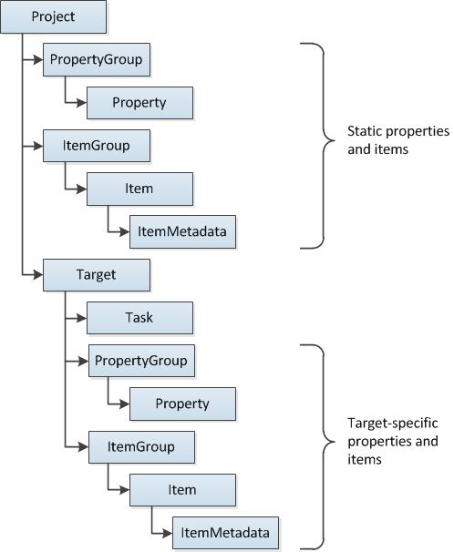

# Introduction

- [Wikipedia](https://en.wikipedia.org/wiki/.NET)

## MSBuild
[Wikipedia](https://en.wikipedia.org/wiki/MSBuild)

MSBuild is a set of tools for building software in various languages created by Microsoft. In this manual, we will only focus on .NET (managed code) projects.

The build is configured by the project (`csproj`) file.

### Project File

[Official documentation](https://learn.microsoft.com/en-us/aspnet/web-forms/overview/deployment/web-deployment-in-the-enterprise/understanding-the-project-file)

The MSBuild project is configured using the `csproj` file, which is a XML file. The file is structure is presented in the following picture:

source: https://learn.microsoft.com/en-us/aspnet/web-forms/overview/deployment/web-deployment-in-the-enterprise/understanding-the-project-file

Under the root `Project` element, the project definition is divided into three types of elements:

- [`PropertyGroup`](https://learn.microsoft.com/en-us/aspnet/web-forms/overview/deployment/web-deployment-in-the-enterprise/understanding-the-project-file#properties-and-conditions): contains the properties for the project, like .NET version
- [`ItemGroup`](https://learn.microsoft.com/en-us/aspnet/web-forms/overview/deployment/web-deployment-in-the-enterprise/understanding-the-project-file#items-and-item-groups): contains the items for the project, like source files, dependencies, etc.
- [`Target`](https://learn.microsoft.com/en-us/aspnet/web-forms/overview/deployment/web-deployment-in-the-enterprise/understanding-the-project-file#targets-and-tasks): build target specification

