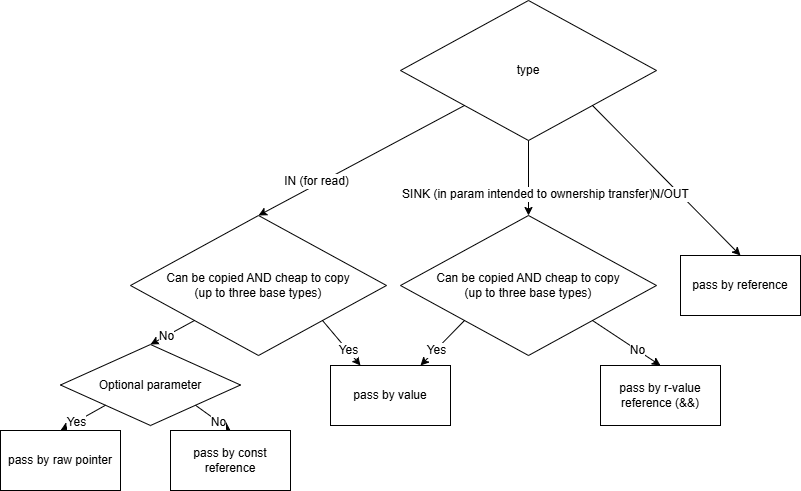

# Source and Header Files
In C++, there are:

- header files, that contain declarations of functions, classes, variables, etc. and, for templated code, the code itself.
	- they have the `.h` or `.hpp` extension
- source files, that contain the definitions of the functions, classes, variables, etc.
	- they have the `.cpp` extension

Each source file added to the target (see [CMake Manual](<./CMake Manual.md>) for adding source files to the target in CMake projects) is compiled into an object file - a *translation unit*. The header files are not compiled, but insted, they serve as a promise that there will be some translation unit that will contain the code that will be linked to the final executable. The above mechanism provides a flexible and practical interface, but a special care must be taken to avoid mistakes, that typically result in a liker error.

Most important here is the [*One Definition Rule (ODR)*](https://en.wikipedia.org/wiki/One_Definition_Rule): each entity (e.g., class, function, variable, etc.) must be defined exactly once in the whole program.

- If something is defined in multiple translation units, it will result in a multiple definition error.
- If we forgot to define some entity, or we do not add the source file with the definition to the target, it will result in an undefined reference error.

Typically, each header has a corresponding source file, that contains the definition of all entities declared in the header. However, there is no requirement to have a single source file for each header, we can separate the code into multiple source files.

Note that **all entities in the translation units added to the target are compiled, even if they are not used**. This is in contrast with the statements inside functions, which are not compiled if they are not used.


# Storage Duration
[cppreference](https://en.cppreference.com/w/cpp/language/storage_duration)

The storage duration of a variable is the period for which the storage is guaranteed to be available. There are the following **storage durations**:

- **static storage duration**: these variables are initialized at the start of the program before the main function is called. They are destroyed at the end of the program, after the main function returns.
- **thread storage duration**: these variables are initialized at the start of the thread before the thread function is called. They are destroyed at the end of the thread, after the thread function returns.
- **automatic storage duration**: these variables are initialized at the point of their declaration and destroyed at the end of the block they are declared in.
- **dynamic storage duration**: these variables are initialized by some memory management mechanism, and they are destroyed by an analogous mechanism.

To determine the scope of a variable, we can use the following **rules**:

1. Variables within the namespace scope (including the undeclared global namespace) have static storage duration unless they are declared with the `thread_local` specifier, in which case they have thread storage duration.
1. block scope variables have automatic storage duration unless they are declared with the `static` specifier, in which case they have static storage duration.
	- block static variables, unlike namespace static variables, are not initialized at the start of the program, but at the first time the line with the declaration is executed.
1. parameters have automatic storage duration.
1. objects created with mechanics like `new`/`delete`, `malloc`/`free`, `new[]`/`delete[]`, or `std::make_unique`, `std::make_shared`, etc. have dynamic storage duration.

An important lesson from these rules is that the global variables have static storage duration even without the `static` specifier. The reason for using the `static` specifier for globals is to control the *linkage* of the variable.


# Type System
[cppreference](https://en.cppreference.com/w/cpp/language/type)

*Type* is a property of each:

- object
- reference
- function
- expression


## Complete and Incomplete Types
In many context, we have to supply a type with a requirement of being a complete type. So what types are incomplete?

- The `void` type is always incomplete
- Any structure without definition (e.g. using `struct structure *ps;`, without defining `structure`.)
- An array without dimensions is an incomplete type: `int a[];` is incomplete, while `int a[5];` is complete.
- An array of incomplete elements is incomplete.

 A type trait that can be used to determine whether a type is complete is described [here](https://devblogs.microsoft.com/oldnewthing/20190710-00/?p=102678).

## Aggregate types
Aggregate types are:

- array types
- class types that fullfill the following conditions
	- no private or protected members
	- no constructores declared (including inherited constructors)
	- no private or protected base classes
	- no virtual member functions

The elements of the aggregate types can and are ment to be constructed using the aggregate initialization (see the local variable initialization section).

## Type Conversion
[cppreference: implicit conversion](https://en.cppreference.com/w/cpp/language/implicit_conversion)

In some context, an implicit type conversion is aplied. This happens if we use a value of one type in a context that expects a different type. The conversion is applied automatically by the compiler, but it can be also applied explicitly using the `static_cast` operator. In some cases where the conversion is potentially dangerous, the `static_cast` is the only way to prevent compiler warnings.


### Numeric Conversion
There are two basic types of numeric conversion:

- standard *implicit conversion* that can be of many types: this conversion is applied if we use an expression of type `T` in a context that expects a type `U`. Example:
	```cpp
	void print_int(int a){
		std::cout << a << std::endl;
	}

	int main(){
		short a = 5;
		print_int(a); // a is implicitly converted to int
	}
	```

- *usual arithmetic conversion* which is applied when we use two different types in an arithmetic binary operation. Example:
	```cpp
	int main(){
		short a = 5;
		int b = 2;
		int c = a + b; // a is converted to int
	}
	```

#### Implicit Numeric Conversion

##### Integral Promotion
Integral promotion is a coversion of an integer type to a larger integer type. The promotion should be safe in a sense that it never changes the value. Important promotions are:

- `bool` is promoted to `int`: `false` -> `0`, `true` -> `1`


##### Integral Conversion
Unlike integral promotion, integral conversion coverts to a smaller type, so the value can be changed. The conversion is safe only if the value is in the range of the target type. Important conversions are:
 

#### Usual Arithmetic Conversion
[cppreference](https://en.cppreference.com/w/cpp/language/usual_arithmetic_conversions)

This conversion is applied when we use two different types in an arithmetic binary operation. The purpose of this conversion is convert both operands to the same type before the operation is applied. The result of the conversion is then the type of the operands. 

The conversion has the following steps steps:

1. lvalue to rvalue conversion of both operands
1. special step for enum types
1. special step for floating point types
1. conversion of both operands to the common type

The last step: the conversion of both operands to the common type is performed using the following rules:

1. If both operands have the same type, no conversion is performed.
1. If both operands have signed integer types or both have unsigned integer types, the operand with the type of lesser [integer conversion rank](https://en.cppreference.com/w/cpp/language/usual_arithmetic_conversions#Integer_conversion_rank) (size) is converted to the type of the operand with greater rank.
1. otherwise, we have a mix of signed and unsigned types. The following rules are applied:
	1. If the unsigned type has conversion rank greater or equal to the rank of the signed type, then the unsigned type is used.
	1. Otherwise, if the signed type can represent all values of the unsigned type, then the signed type is used.
	1. Otherwise, both operands are converted to the unsigned type corresponding to the signed type (same rank).

Here **especially the rule 3.1 leads to many unexpected results** and hard to find bugs. Example:
```cpp
int main(){
	unsigned int a = 10;
	int b = -1;
	auto c = b - a; // c is unsigned and the value is 4294967285
}
```
To avoid this problem, **always use the `static_cast` operator if dealing with mixed signed/unsigned types**.


## Show the Type at Runtime
It may be useful to show the type of a variable at runtime:

- for debugging purposes
- for logging
- to compare the types of two variables

Note however, that in C++, there is no reflection support. Therefore, **we cannot retrieve the name of the type at runtime in a reliable way**. Instead, the name retrieved by the methods described below can depend on the compiler and the compiler settings.


### Resolved complicated types
Sometimes, it is useful to print the type, so that we can see the real type of some complicated template code. For that, the following template can be used:

```cpp
#include <string_view>

template <typename T>
constexpr auto type_name() {
  std::string_view name, prefix, suffix;
#ifdef __clang__
  name = __PRETTY_FUNCTION__;
  prefix = "auto type_name() [T = ";
  suffix = "]";
#elif defined(__GNUC__)
  name = __PRETTY_FUNCTION__;
  prefix = "constexpr auto type_name() [with T = ";
  suffix = "]";
#elif defined(_MSC_VER)
  name = __FUNCSIG__;
  prefix = "auto __cdecl type_name<";
  suffix = ">(void)";
#endif
  name.remove_prefix(prefix.size());
  name.remove_suffix(suffix.size());
  return name;
}
```
Usage:

```cpp
std::cout << type_name<std::remove_pointer_t<typename std::vector<std::string>::iterator::value_type>>() << std::endl;

// Prints: class std::basic_string<char,struct std::char_traits<char>,class std::allocator<char> >
```

[Source on SO](https://stackoverflow.com/a/56766138/1827955)


### Show the user-provided types (std::type_info)
If we want to show the type of a variable provided by the user (e.g., by a function accepting `std::any`), we can use the [`typeid`](https://en.cppreference.com/w/cpp/language/typeid) operator which returns a [`std::type_info`](https://en.cppreference.com/w/cpp/types/type_info) object.  


# Value Categories
[cppreference](https://en.cppreference.com/w/cpp/language/value_category).

In many contexts, the value category of an expression is important in deciding whether the code compiles or not, or which function or template overload is chosen. Therefore, it is usefull to be able to read value categories.

expression value types:

- *lvalue*, meaning left-value. An expression typically on the left side of compound expression a statement, e.g. variable, member, or function name. Also, lvalues expressions are are:
    - function ratoalls to fuctions returning lvalue
    - assignments
    - `++a`, `--a` and similar pre operators
    - `*a` indirection
    - string literal
    - cast
    - *prvalue*, meaning pure rvalue. It is either a result of some operand (`+`, `/`) or a constructor/initializer result. The foloowing expressions are prvalues:
    - literals with exception of string literals, e.g.: `4`, `true`, `nullptr`
    - function or operator calls that return rvalue (non-reference)
    - `a++`, `a--` and other post operators
    - arithmetic and logical expressions
    - `&a` address of expression
    - `this`
    - non-type template parameters, unless they are references
    - lambda expressions
    - requires expressions and concept spetializations
- *xvalue*, meaning expiring value. These valaues usually represent lvalues converted to rvalues. Xvalue expressions are:
- function call to functions returning rvalue reference (e.g., [`std::move`](https://en.cppreference.com/w/cpp/utility/move)).
- member object expression (`a.m`) if `a` is an rvlaue and `m` is a non-reference type
- *glvalue* = *lvalue* `||` *xvalue*.
- *rvalue* = *prvlaue* `||` *xvalue*.


# Operators

- [cppreferencen](https://en.cppreference.com/w/cpp/language/operators)
- [SO answer describing typical operator overloading idioms](https://stackoverflow.com/questions/4421706/what-are-the-basic-rules-and-idioms-for-operator-overloading/4421719#4421719)

C++ supports almost all the standard operators known from other languages like Java, Python, or C#. Additionally, these operators can be overloaded.

There are several categories of operators:

- [arithmetic operators](https://en.cppreference.com/w/cpp/language/operator_arithmetic), including bitwise operators
- [comparison operators](https://en.cppreference.com/w/cpp/language/operator_comparison)
- [logical operators](https://en.cppreference.com/w/cpp/language/operator_logical)
- assignment operators

Note that the standard also supports [**alternative tokens**](https://en.cppreference.com/w/cpp/language/operator_alternative) for some operators (e.g., `&&` -> `and`, `||` -> `or`, `!` -> `not`). However, these are not supported by all compilers. In MSVC, the [`/permissive-`](https://docs.microsoft.com/en-us/cpp/build/reference/permissive-standards-conformance?view=vs-2019) flag needs to be used to enable these tokens.


## Comparison Operators
### Default Comparison Operators
[cppreference](https://en.cppreference.com/w/cpp/language/default_comparisons).

The `!=` is usually not a problem, because it is implicitely generated as a negation of the `==` operator. However, **the `==` is not generated by default, even for simple classes**. To force the generation of a default member-wise comparison operator, we need to write:

```c++
bool operator==(const My_class&) const = default;
```

However, to do that, all members and base classes have to ae the operator `==` defined, otherwise the default operator will be implicitely deleted.

The comparability can be checked with a `std::equality_comparable<T>` concept:
```cpp
staic_assert(std::equality_comparable<My_class>);
``` 

## Ternary Operator
[cppreference](https://en.cppreference.com/w/cpp/language/operator_other#Ternary_operator)

Ternary operator in C++ has the classical syntax of 
```
<condition> ? <true_expression> : <false_expression>;
```

Note that **both the true and false expressions must evaluate to the same type**. Therefore, if we use polymorphism, we need to use manual type casting to the base type for at least one of the expressions (instead of relying on the implicit conversion when assigning to the result variable).


## `typeid`
The [`typeid`](https://en.cppreference.com/w/cpp/language/typeid) operator returns a [`std::type_info`](https://en.cppreference.com/w/cpp/types/type_info) object that contains information about the type of the expression.
Typically, we store the `type_info` in a [`std::type_index`](https://en.cppreference.com/w/cpp/types/type_index) wrapper.


# Control Structures
C++ supports the control structures known from other languages like Java, Python, or C#. Here, we focus on the specifics of C++.


## Switch Statement
[cppreference](https://en.cppreference.com/w/cpp/language/switch)

In C++, we can switch on integer types or enumeration types. Also, we can use classes that are implicitely convertible to integers or enums. Switch on string is not possible.

The switch statement has the following syntax:
```cpp
switch(expression){
	case value1:
		// code
		break;
	case value2:
		// code
		break;
	default:
		// code
}
```
However, it is usually a good idea to wrap each case in a block to create a separate scope for each case. Without it, the whole switch is a single block (contrary to if/else statements). The swich statements just jump to a case that matches the value, similarly to a `goto` statement. This can create problems, as for example variable initialization cannot be jumped over. The safe case statement looks like:
```cpp
switch(expression){
	case value1:{
		// code
		break;
	}
	case value2:{
		// code
		break;
	}
	default:{
		// code
	}
}
```


# Functions
[cppreference](https://en.cppreference.com/w/cpp/language/functions)

## Function Declaration and Definition
In C and C++, functions must have a:
- **declaration** (signature) that specifies the function name, return type, and parameters
- **definition** that specifies the function body

The declaration has to be provided before the first use (call) of the function. The definition can be provided later.

The declaration is typically provided in a header file, so that the function can be used outside the translation unit. The definition is typically provided in a source file.

### Merged Declaration and Definition
If the function is not used outside the translation unit, the declaration and definition can be merged, i.e., the definition is itself a declaration. However, this is not recommended because after adding a corresponding declaration to one of the included headers (including libraries), the merged declaration/definition will become a definition of that function, which will be manifested as a linker error (multiple definitions of the function). Therefore, to control the visibility of the function, it is better to use other methods, provides in Section [Visibility of Functions](#function-visibility).


## Deciding between free function, member function and static member function
Basically, you should decide as follows:

1. Function needs access to instance -> **member function**
1. Function
    - should be called only by class members (i.e., member functions), so we want to limit its visibility, or
    - we need to access static members of the class -> **static member function**
1. Otherwise -> **free function**


## Function Parameters
We can pass parameters to a function in several ways:

- by value: `void func(int a)`
- by reference: `void func(int& a)`
- by const reference: `void func(const int& a)`
- by pointer: `void func(int* a)`
- by rvalue reference: `void func(int&& a)`
- and several other less common ways.

Below is the decision tree for choosing the parameter type:



Sometimes, we can see `auto` as a parameter type. This is not parameter type, but a shorthand for the function template called [abbreviated function templates](#abbreviated-function-templates).


### Argument-parameter Conversions

Arg/param | value | reference | rvalue
-- |--|--|--
value | - | - | `std::move` 
reference | implicit copy | - | copy constructor
rvalue | - | not possible | -


### Default Parameters
Default function parameters  in C++ works similarly to other languages:
```c++
int add(int a, int b = 10);

add(1, 2) // 3
add(1) // 11
```

However, the default parameters works only if we call the function by name. Therefore, we cannot use them in std::function and similar contexts. Example:

```c++
std::function<int(int,int)> addf = add;
std::function<int(int)> addf = add; // does not compile

addf(1) // does not compile
```

Also, the default parameters need to be values, not references or pointers. For references and pointers, we should use function overloading.

#### Default Parameters and Inheritance
TLDR: do not use default parameters in virtual functions.

The default parameters are resolved at compile time. Therefore, the value does not depend on the actual type of the object, but on the declared type of the variable. This have following consequences:

- the default parameters are not inherited
- `A* a = new B(); a->foo()` will call `B::foo()`, with the default parameters of `A::foo()`

To prevent confusion with inheritence we should use function overloading instead of default parameters in virtual functions (like in Java).


## Return values and NRVO
For deciding the return value format, refer to the [return value decision tree](https://drive.google.com/file/d/1Ml6g63_mbgjmRRByIItayAuEnhDymnH_/view?usp=sharing).

Especially, note that [NRVO](https://en.wikipedia.org/wiki/Copy_elision#RVO) is used in modern C++ and therefore, we can return all objects by value with no overhead most of the time.

The NRVO works as follows:

1. compiler tries to just tranfer the object to the parent stack frame (i. e. to the caller) without any move or copy
2. if the above is not possible, the move constructor is called.
3. if the above is not possible, the copy constructor is called.

From C++17, the RVO is mandatory, therefore, it is unlikely that the compiler use a move/copy constructor.
Consequently, most of the times, we can just return the local variable and let the rest to the compiler:
```cpp
unique_ptr<int> f(){
  auto p = std::make_unique<int>(0);

  return p; // works, calls the move constructor automatically in the worst case (pre C++17 compiler)
  // return move( p ); // also works, but prevents NRVO
}
```

The NRVO is described also on [cppreference](https://en.cppreference.com/w/cpp/language/copy_elision) together with initializer copy elision.

## Function Overlaoding
Both normal and member funcions in C++ can be overloaded. The oveload mechanic, however, is quite complicated. There can be three results of overload resolution of some function call:

- no function fits -> error
- one function fits the best
- multiple functions fits the best -> error

The whole algorithm of overload resolution can be found on [cppreference](https://en.cppreference.com/w/cpp/language/overload_resolution).

First, *viable* funcions are determined as functions with the same name and:

- with the same number of parameters
- with a greater number of parameters if the extra parameters has default arguments

If there are no viable functions, the compilation fails. Otherwise, all viable functions are compared to get the best fit. The comparison has multiple levels. The basic principle is that if only one function fits the rules at certain level, it is chosen as a best fit. If there are multiple such functions, the compilation fails. Levels:

1. Better *conversion* priority (most of the time, the best fit is found here, see conversion priority and ranking bellow)

12. non-template constructor priority

### Conversion prioritiy and ranking
[cppreference](https://en.cppreference.com/w/cpp/language/overload_resolution#Ranking_of_implicit_conversion_sequences)

When the conversion takes priority during the best viable function search, we say it is *better*. The (incomplete) algorithm of determining *better* conversion works as follows:

1. standard conversion is better than user defined conversion
2. user defined conversion is better then elipsis (`...`) conversion
3. comparing two standard conversions:
	1. if a conversion sequence S1 is a subsequence of conversion sequence S2, S1 is better then S2
	2. lower rank priority
	3. rvalue over lvalue if both applicable
	4. ref over const ref if both applicable

#### Conversion sequence ranks

1. **exact match**
2. **promotion**
3. **conversion**: includes class to base conversion


### Constructor argument type resolution in list initialization
When we use a list initailization **and** it results in a constructor call, it is not immediatelly clear which types will be used for arguments as the initialization list is not an expression. These types are, however, critical for the finding of best viable constructor. The following rules are used to determine the argument types (simplified):

1. 


## `auto` return type
For functions that are defined inside declaration (template functions, lambdas), the return type can be automatically deduced if we use the `auto` keyword. 

The decision between value and reference return type is made according to the following rules:

- return type `auto` -> return by value
- return type `auto&` -> return by reference
- return type `auto*` -> return by pointer
- return type `decltyype(auto)` -> the return type is `decltype(<RETURN EXPRESSION>)`

See more rules on [cppreference](https://en.cppreference.com/w/cpp/language/function#Return_type_deduction)

Note that **the `auto` return type is not allowed for functions defined outside the declaration** (unless using the trailing return type).


## Function visibility
The **member function** visibility is determined by the access specifier, in the same manner as the member variable visibility. 

For **free functions**, the visibility is determined by the *linkage specifier*. Without the specifier, the function is visible. To make it visible only in the current translation unit, we can use the `static` specifier. 

An equivalent way to make a function visible only in the current translation unit is to put it into an *anonymous namespace*:
```cpp
namespace {
	void f() {}
}
```
This way, the function is visible in the current translation unit, as the namespace is implicitly imported into it, but it is not visible in other translation units, because anonymous namespaces cannot be imported.

One of the other approches frequently used in C++ is to **put the function declaration into the source file** so it cannot be included from the header. This solution is, however, flawed, unsafe, and therefore, **not recommended**. The problem is that this way, the function is still visible to the linker, and can be mistakenly used from another translation unit if somebody declare a function with the same name.


## Deleting functions
[cppreference](https://en.cppreference.com/w/cpp/language/function#Deleted_functions)

We can delete functions using the `delete` keyword. This is mostly used for preventing the usage of copy/move constructors and assignment operators. However, it can be used for any function, as we illustrate in the following example:
```cpp
class My_class{
	print_integer(int a){
		std::cout << a << std::endl;
	}
	// we do not want to print doubles even they can be implicitly converted to int
	print_integer(double a) = delete; 
}
```


# Initialization and Assignment

## Loacal variables initialization/assignment
[Initialization](https://en.cppreference.com/w/cpp/language/initialization) happens in many **contexts**:

- in the declaration
- in `new` expression
- function parameter initialization
- return value initialization

The **syntax** can be:

- `(<expression list>)`
- ` = expression list`
- `{<initializer list>}`

Finally, there are multiple initialization types, the resulting **initialization type** depends on both context and syntax:

- Value initialization: `std::string s{};`
- Direct initialization: `std::string s{"value"}`
- Copy initialization: `std::string s = "value"`
- List initialization: `std::string s{'v', 'a', 'l', 'u', 'e'}`
- Aggregate initialization: `char a[3] = {'a', 'b'}`
- Reference initialization: `char& c = a[0]`
- Default initialization: `std::string s`

### List initialization
[List initialization](https://en.cppreference.com/w/cpp/language/list_initialization) initializes an object from a list. he list initialization has many forms, including:

- `My_class c{arg_1, arg_2}` 
- `My_class c = {arg_1, arg_2}`
- `my_func({arg_1, arg_2})`
- `return {arg_1, arg_2}`

The list initialization of a type `T` can result in various initializations/constructios depending on many aspects. Here is the simplified algorithm:
 1. `T` is aggregate -> aggregate initialization
 2. The initializer list is empty and `T` has a default constructor -> value initialization
 3. `T` has an constructor accepting `std::initializer_list` -> this constructor is called
 4. other constructors of `T` are considered, excluding explicit constructors

### Value initialization
[cppreference](https://en.cppreference.com/w/cpp/language/value_initialization)

This initializon is performed when we do not porvide any parameters for the initialization. Depending on the object, it results in either defualt or zero initialization.

### Aggregate initialization
[Aggregate initialization](https://en.cppreference.com/w/cpp/language/aggregate_initialization) is an initialization for aggregate types. It is a form of list initialization. Example:

```cpp
My_class o1{arg_1, arg_2};
My_class o2 = {arg_1, arg_2}; // equivalent
```

The list initialization of type `T` from an initializer list results in aggregate initialization if these conditions are fullfilled:

- the initializer list contains more then one element
- T is an aggregate type

### Nested initialization
**It is not possible to create nested initializatio statements** like:
```cpp
class My_class{
	int a,
	float b;

public:
	My_class(ina a, float b): a(a), b(b)
}

std::tuple<int, My_class>{2, {3, 2.5}} // does not compile
std::tuple<int, My_class>{2, My_class{3, 2.5}} // correnct version
```


## Member Initialization/Assignment
There are two ways of member initialization:

- **default member initialization**
- initialization using **member initializer list**

And then, there is an assignment option in  **constructor body** .

Reference:

- [default member initialization](https://en.cppreference.com/w/cpp/language/data_members#Member_initialization)
- [constructor and initializer list](https://en.cppreference.comwcplng/w/cpp/language/constructor)

One way or another, **all members should be initialized at the constructor body at latest**, even if we assign them again during all possible use cases. Reason:

- some types (numbers, enums, ...) can have arbitrary values when unassigned. This can lead to confusion when debugging the class, i.e., the member can appear as initialized even if it is not.
- easy support for overloading constructors, we can sometimes skip the call to the constructor with all arguments
- we can avoid default arguments in the constructor


It is important to **not use virtual functions in member initialization or constructor body**, because the function table is not ready yet, so the calls are hard wired, and the results can be unpredictable, possibly compiler dependent.

### Default Member Initialization 
Either a **brace initializer**:
```C++
My_class{
	int member{1} 
}
```
or an **equals initializer**:
```C++
My_class{
	int member = 1 
}
```


### Member Initializer List
Either using [**direct initialization**](https://en.cppreference.com/w/cpp/language/direct_initialization) (calling constructor of `member`):
```C++
My_class{
	My_class(): member(1){
	}
```
or [**list initialization**](https://en.cppreference.com/w/cpp/language/list_initialization):
```C++
My_class{
	My_class(): member{1}{
	}
```

### Constructor Body
```C++
My_class{
	My_class(){
		member = 1
	}
}
```

### Comparison Table
Ordered by priority, i.e., each method makes the methods bellow ignored/ovewritten if applied to the same member.

| Type | In-place | works for const members |
|--|--|--|
| Constructor body | no | no |
| Member initializer list | yes | yes |
| Default member initializer | yes, if we use direct initialization | yes |


# Const vs non-const

The `const` keyword shows up in two broad roles:

- As a **type qualifier** on variables and other declarations, so the named object is non-mutable in the sense described below ([cppreference](https://en.cppreference.com/w/cpp/language/cv)).
- As a **member-function qualifier** on classes (the `const` at the end of a member function declaration). That, together with `const` objects, `mutable` members, move semantics, duplicated const/non-const overloads, and inheritance quirks, is covered in [C++ Classes](C++%20Classes.md#const-correctness-for-classes).

## `const` as a type qualifier (non-class and general rules)

A variable names a **non-mutable** object when that object is `const`-qualified for that use. For ordinary scalar or non-class variables, that simply means the variable was declared with `const`.

Non-mutable variables:

- cannot be reassigned after initialization;
- in **pointers, references, and function parameters**, *top-level* vs *low-level* `const` matters: it controls whether you may rebind the pointer/reference and whether you may modify the pointee ([cppreference](https://en.cppreference.com/w/cpp/language/cv)).

When the variable's type is a **class type**, the same `const` on the object also restricts which member functions you can call (non-`const` overloads are not selected on a `const` object). Subobjects of a `const` complete object behave as `const` unless they are `mutable`. Those class-specific rules are spelled out in [C++ Classes](C++%20Classes.md#const-correctness-for-classes).


# Type Traits
The purpose of type traits is to create predicates involving teplate parameters. Using type traits, we can ask questios about template parameters. With the answer to these questions, we can even implement conditional compilation, i.e., select a correct template based on parameter type. Most of the STL type traits are defined in header [`type_traits`](https://en.cppreference.com/w/cpp/header/type_traits).

A type trate is a template with a constant that holds the result of the predicate, i.e., the answer to the question.

[More about type traits](https://www.internalpointers.com/post/quick-primer-type-traits-modern-cpp)


## Usefull Type Traits

- [`std::is_same`](https://en.cppreference.com/w/cpp/types/is_same)
- [`std::is_base_of`](https://en.cppreference.com/w/cpp/types/is_base_of)
- [`std::is_convertible`](https://en.cppreference.com/w/cpp/types/is_convertible)
- [`std::conditional`](https://en.cppreference.com/w/cpp/types/conditional): enables if-else type selection


## Replacement for old type traits
Some of the old type traits are no longer needed as they can be replaced by new language features, which are more readable and less error prone. Some examples:

- [`std::enable_if`](https://en.cppreference.com/w/cpp/types/enable_if) can be replaced by concepts:
```cpp

// old: enable_if
template<class T>
void f(T x, typename std::enable_if_t<std::is_integral_v<T>, void> = 0) {
	std::cout << x << '\n';
}

// new: concepts
template<std::integral T>
void f(T x) {
	std::cout << x << '\n';
}
```


# Concepts
[cppreference](https://en.cppreference.com/w/cpp/language/constraints)

Concepts are named sets of requiremnets. They can be used instead of `class`/`typename` keywords to restrict the template types.

The syntax is:
```cpp
template<class T, ....>
concept concept-name = constraint-expression
```

The concept can have multiple template parameters. The first one in the declaration stands for the concept itself, so it can be refered in the constraint expression. More template parameters can be optionally added and their purpose is to make the concept generic.

## Constraints
Constraints can be composed using `&&` and `||` operatos. For atomic constaints declaration, we can use:

- Type traits:
```cpp
template<class T>
concept Integral = std::is_integral<T>::value;
```

- Concepts: 
```cpp
template<class T>
concept UnsignedIntegral = Integral<T> && !SignedIntegral<T>;
```

- Requires expression:
```cpp
template<typename T>
concept Addable = requires (T x) { x + x; };
```

Either form we chose, the atomic constraint have to always evaluate to bool. 

## Requires Expression
Requires expressions ar ethe most powerfull conctraints. The syntax is:
```cpp
requires(<parameter list>) { <requirements> }
```

Here, the `<parameter list>` is a list of objects (instances of types) that we need to use in the `<requirements>`.

There are four types of `<requirements>` that can appear in the requires expression:

- *simple requiremnet*: a requirement that can contain any expression. Evaluates to true if the expression is valid.
	```cpp
	requires (T x) { x + x; };
	```

- *type requirement*: a requiremnt checking the validity of a type:
	```cpp
	requires
	{
		typename T::inner; // required nested member name
		typename S<T>;     // required class template specialization
		typename Ref<T>;   // required alias template substitution
	};
	```

- *compound requirement*: Checks the arguments and the return type of some call. It has the form: `{expression} -> return-type-requirement;`
	```cpp
	requires(T x)
	{
		{*x} -> std::convertible_to<typename T::inner>;
	}
	```

	- other [useful type traits](#usefull-type-traits) can be used instead of `std::convertible_to`.

- *Nested requirement*: a require expression inside another requires expression:
	````cpp
	requires(T a, size_t n)
	{
		requires Same<T*, decltype(&a)>; // nested
	}
	````

## Auto filling the first template argument
Concepts have a special feature that their first argument can be autoffiled from outer context. Consequentlly, you then fill only the remaining arguments. Examples:

```cpp
//When using the concept
template<class T, class U>
concept Derived = std::is_base_of<U, T>::value;
 
template<Derived<Base> T>
void f(T); // T is constrained by Derived<T, Base>

// When defining the concept
template<typename S>
concept Stock = requires(S stock) {
	// return value is constrained by std::same_as<decltype(stock), double>
	{stock.get_value()} -> std::same_as<double>; 
}
```

## STL Concepts

- [iterator concepts](https://en.cppreference.com/w/cpp/header/iterator)
- [`std::same_as`](https://en.cppreference.com/w/cpp/types/same_as): checks if two types are the same

## Usefull Patterns
### Constrain a Template Argument
Imagine that you have a template function `load` and an abstract class `Loadable_interface` that works as an interface:
```c++
class Loadable_interface{
	virtual void load() = 0;
};

template<class T>
void load(T to_load){
	...
	to load.load()
	...
};
```

Typically you want to constraint the template  argument `T` to the `Loadable_interface` type, so that other developer clearly see the interface requirement, and receives a clear error message if the requirement is not met. 

In Java, we have an `extend` keyword for this purpose that can constraint the template argument. In C++, this can be solved with concepts. First we have to define a concept that requires the interface:
```c++
template<typename L>
concept Loadable =
std::is_base_of_v<Loadable_interface, L>;
```
Than we can use the concept like this:
```c++
template<Loadable T>
void load(T to_load){
	...
	to load.load()
	...
};
```

## Constraint a Concept Argument
Imagine that you have a concept `Loadable` that requires a method `load` to return a  type `T` restricted by a concept `Loadable_type`. One would expect to write the `loadable` concept like this:
```c++
template<typename L, Loadable_type LT>
concept Loadable = 
requires(L loadable) {
	{loadable.load()} -> LT;
};
```
However, this is not possible, as there is a rule that **concept cannot not have associated constraints**. The solution is to use an unrestricted template argument and constrain it inside the concept definition:
```c++
template<typename L, typename LT>
concept Loadable =
Loadable_type<LT> &&
requires(L loadable) {
	{loadable.load()} -> LT;
};
```


## Sources
[https://en.cppreference.com/w/cpp/language/constraints](https://en.cppreference.com/w/cpp/language/constraints)

[Requires expression explained](https://akrzemi1.wordpress.com/2020/01/29/requires-expression/)


# Interfaces
In programming, an interface is usualy a set of requirements that restricts the function or template parameters, so that all types fulfiling the requiremnet can be used as arguments.

Therte are two ways how to create an interface in C++:

- using the *polymorphism*
- using *templates argument restriction*

While the polymorphism is easier to implement, the templating is more powerful and it has zero overhead. The most important thing is probably that despite these concepts can be used together in one application, not all "combinations" are allowed especialy when using tamplates and polymorphism in the same type.

**Note that in C++, polymorphism option work only for function argument restriction, but we cannot directly use it to constrain template arguments** (unlike in Java). 

To demonstrate all possible options, imagine an interface that constraints a type that it must have the following two functions:
```cpp
int get_value();
void set_value(int date);
```
The following sections we will demonstrate how to achieve this using multiple techniques. 


## Interface using polymorfism
Unlike in java, there are no `interface` types in C++. However, we can implement polymorfic interface using abstract class. The following class can be used as an interface:

```cpp
class Value_interface{
	virtual int get_value() = 0;
	virtual void set_value(int date) = 0;
}
```

To use this interface as a fuction argument or return value, follow this example:
```cpp
std::unique_ptr<Value_interface> increment(std::unique_ptr<Value_interface> orig_value){
	return orig_value->set_value(orig_value->get_value() + 1);
}
```
This system works in C++ because it supports multiple inheritance. Do not forget to use the `virtual` keyword, otherwise, the method cannot be overriden.
Note that unlike in other languages, **in C++, the polymorphism cannot be directly use as a template (generic) interface.** Therefore, we cannot use the polymorfism alone to restrict a type.


## Using template argument restriction as an interface
To use template argument restriction as an interface, we can use concepts. The following concept impose the same requirements as the interface from the polymorphism section:
To use template argument restriction as an interface, we can use concepts. The following concept impose the same requirements as the interface from the polymorphism section:

```cpp
template<class V>
concept Value_interface = 
	requires(V value_interface){{value_interface.get_value()} -> std::same_as<int>; }
	&& requires(V value_interface, int value){{value_interface.set_value(value)} -> std::same_as<void>; }
```

Remember that **the return type of the function has to defined by a concept**,  the type cannot be used directly. Therefore, the following require statement is invalid:
```cpp
requires{(V value_interface){value_interface.get_value()} -> int; }
```

To use this interface as an template argument in class use:
```cpp
template<Value_interface V>
class ...
```

And in function arguments and return types:

```cpp
template<Value_interface V> V increment(V orig_value){
	return orig_value.set_value(orig_value.get_value() + 1);
```


### Restricting the member function to be const
To restrict the member function to be const, we neet to make the type value const in the requires expression:
```cpp
template<class V>
concept Value_interface = requires{(const V value_interface) 
	{valvalue_interfaceue.get_value() -> std::same_as<int>;};
};
```


## Using concepts and polymorphism together to restrict template parameters with abstract class
We cannot restrict template parameters by polymorphic interface directly, however, we can combine it with concept. The folowing concept can be used together with the interface from the polymorphic interface section:

```cpp
template<class V>
concept Value_interface_concept = requires std::is_base_of<Value_interface,V>
```

**Neverthless, as much as this combination can seem to be clear and elegent, it brings some problems.**. We can use concepts to imposed many interfaces on a single type, but with this solution, it can lead to a polymorphic hell. While there is no problem with two concepts that directly requires the same method to be present with abstract classes, this can be problematic.
Moreover, we will lose the zero overhead advantage of the concepts, as the polymorphism will be used to implement the interface.


## The Conflict Between Templates and Polymorphism
As described above, messing with polymorphism and templates together can be tricky. Some examples:

### No Virtual Member Function with Template Parameters
An example: a virtual (abstract) function cannot be a template function ([member template function](https://en.cppreference.com/w/cpp/language/member_template) cannot be virtual), so it cannot use template parameters outside of those defined by the class template.

### Polymorphism cannot be used inside template params
If the functin accepts `MyContainer<Animal>` we cannot call it with `MyContainer<Cat>`, even if `Cat` is an instance of Animal.

### Possible solutions for conflicts

-   do not use templates -> more complicated polymorphism (*type erasure* for members/containers)
-   do not use polymorphism -> use templates for interfaces
-   an [adapter](https://www.sciencedirect.com/science/article/pii/S0167642309000021) can be used


## Polymorphic members and containers
When we need to store various object in the same member or container, we can use both templates and polymorphism. However, both techniques has its limits, summarized in the table below:
| | Polymorphism | Templates |
| -- | -- | -- |
| The concrete type has to be known at compile time | `No` | `Yes`
| For multiple member initializations, the member can contain any element. | `No`, the elements have to share base class. | `Yes` |
| For a single initialization, the containar can contain multiple types of objects | `Yes`, if they have the same base class | `No` 
| We can work with value members | `No` | `Yes`
| When using the interface, we need to use downcasting and upcasting | `Yes` | `No`

## Deciding between template and polymorphism
Frequently, we need some entity(class, function) to accept multiple objects through some interface. We have to decide, whether we use templates, or polymorphism for that interface. Some decision points:

- We need to return the same type we enter to the class/function -> use templates
- We have to access the interface (from outside) without knowing the exact type -> use polymorphism
- We need to restrict the member/parametr type in the child -> use templates for the template parameter
- if you need to fix the relation between method parameters/members or template arguments of thouse, you need to use templates 
- If there are space considerations, be aware that every parent class adds an 8 byte pointer to the atribute table

In general, the polymorphic interface have the following adventages:

- easy to implement
- easy to undestand
- similar to what people know from other languages

On the other hand, the interface using concepts has the following adventages:

- no need for type cast
- all types check on compile time -> no runtime errors
- zero overhead
- no object slicing -> you don't have to use pointers when working with this kind of interface
- we can save memory because we don't need the vtable pointers


# Lambda Functions
In c++ [lambda functions](https://en.cppreference.com/w/cpp/language/lambda) are defined as:
```cpp
[<capture>](<params>) -> <return_type> { <code> }
```

The rerurn type is optional, but sometimes required (see below). 

Since C++23, the parantheses are optional if there are no functon parameters.

## Captures
Anything that we want to use from outside has to appear in capture. To prevent copying, we should capture by reference, using `&` before the name of the variable.
```cpp
[&var_1] // capture by reference
[var_1] // capture by value
[&] // default capture by reference
```

For the detailed explanation of the captures, see [cppreference](https://en.cppreference.com/w/cpp/language/lambda#Lambda_capture).

## Return type
The return type of lambda functions can be set only using the trailing return type syntax (`-> <RETURN TYPE>` after the function params). The return type can be omited. Note however, that **the default return type is `auto`**, so in case we want to return by reference, we need to add at least `-> auto`, or even a more specific return type.


## Specifiers
Lambda functions can have special specifiers:

- `mutable`: lambda can modify function parameters capture by copy


# Exceptions
In C++, exceptions works simillarly as in other languages. 

Standard runtime error can be thrown using the [`std::runtime_error`](https://en.cppreference.com/w/cpp/error/runtime_error) class:
```cpp
throw std::runtime_error("message");
```

Always catch exception by reference! 

Note that unlike in Java or Python, there is no default exception handler in C++. Therefore, if an exception is not caught and, in conclusion, the program is terminated, there is no useful information about the exception in the standard output. Instead, we only receive the exit code. For this reason, it is a good practice to catch all exceptions in the main function and print the error message. Example:
```cpp
int main() {
	try {
		<the code of the whole program here>
	} catch(...) {
		const std::exception_ptr& eptr = std::current_exception();
		if (!eptr) {
        	throw std::bad_exception();
		}

		/*char* message;*/
		std::string message;
		try {
			std::rethrow_exception(eptr);
		}
		catch (const std::exception& e) {
			message = e.what();
		}
		catch (const std::string& e) {
			message = e;
		}
		catch (const char* e) {
			message = e;
		}
		catch(const GRBException& ex) {
			message = fmt::format("{}: {}", ex.getErrorCode(), ex.getMessage());
		}
		catch (...) {
			message = "Unknown error";
		}

		spdlog::error(message);
		return message;
	}
}
```


## Rethrowing Exceptions
We can rethrow an exception like this:
```cpp
catch(const std::exception& ex){
	// do ssomething
	...
	throw;
}
```

Note that **in parallel regions, the exception have to be caught before the end of the parallel region**, otherwise the thread is killed.

## How to Catch Any Exception
In C++, we can catch any exception with:
```cpp
catch (...) {
    
}
```
However, this way, we cannot access the exception object. As there is no base class for exceptions in C++, there is no way to catch all kind of exception objects in C++.

## `noexcept` specification
A lot of templates in C++ requires functions to be [`noexcept`](https://en.cppreference.com/w/cpp/language/noexcept_spec) which is usually checked by a type trait [`std::is_nothrow_invocable`](https://en.cppreference.com/w/cpp/types/is_invocable). We can easily modify our function to satisfy this by adding a `noexcept` to the function declariaton.

There are no requirements for a `noexcept` function. It can call functions without noexcept or even throw exceptions itself. The only difference it that uncought exceptions from a `noexcept` function are not passed to the caller. Instead the program is terminated by calling [`std::terminate`](https://en.cppreference.com/w/cpp/error/terminate), which otherwise happens only if the `main` function throws.

By default, only constructors, destructors, and copy/move operations are noexcept.


## Stack traces
Unlike most other languages, C++ does not print stack trace on program termination. The only way to get a stack trace for all exceptions is to set up a custom terminate handler an inside it, print the stack trace. 

**However, as of 2023, all the stack trace printing/generating libraries requires platform dependent configuration and fails to work in some platforms or configurations.**

Example:
```cpp
 void terminate_handler_with_stacktrace() {
    try {
        <stack trace generation here>;
    } catch (...) {}
    std::abort();
}

std::set_terminate(&terminate_handler_with_stacktrace);
```

To create the stacktrace, we can use one of the stacktrace libraries:

- [stacktrace](https://en.cppreference.com/w/cpp/header/stacktrace) header from the standard library if the compiler supports it (C++ 23)
	- as of 2024-04, only MSVC supports this functionality
- [cpptrace](https://github.com/jeremy-rifkin/cpptrace)
- [boost stacktrace](https://github.com/boostorg/stacktrace/)


# Type Aliases
Type aliases are short names bound to some other types. We can introduce it either with `typedef` or with `using` keyword. Examples (equvalent):

```cpp
typedef int number;
using number = int;

typedef void func(int,int);
using func = void(int, int)
```

The `using`new syntax is more readable, as the alias is at the begining of the expression. But why to use type aliases? Two strong motivations can be:

- **iImprove the readebility**: When we work with a type with a very long declaration, it is wise to use an alias. We can partialy solve this issue by using auto, but that is not a complete solution
- **Make the refactoring easier**: When w work with aliases, it is easy to change the type we work with, just by redefining the alias. 

Note that **type aliases cannot have the same name as variables in the same scope**. So it is usually safer to name type aliases with this in mind, i.e., `using id_type = ..` insted of `using id = ..`

## Template Aliasis
We can also create template aliases as follows:
```cpp
template<class A, typename B> 
class some_template{ ... };

template<class T>
using my_template_alias = some_template<T, int>; 
```


## Aliases inside classes
The type alias can also be  placed inside a class. From outside the class, it can be accessed as `<CLASS NAME>::<ALIAS NAME>`:
```cpp
class My_class{
public:
	using number = unsigned long long
	
	number n = 0;
}

My_class::number number = 5;
```

# Constant Expressions
[cppreference](https://en.cppreference.com/w/cpp/language/constant_expression).

A constant expression is an expression that can be evaluated at compile time. The result of constant expression can be used in static context, i.e., it can be:

- assigned to a `constexpr` variable,
- tested for true using `static_assert`

Unfortunatelly, [there is no universal way how to determine if an expression is a constant expression](https://stackoverflow.com/a/47538175/1827955).

## Compile Time Branching
For compile time branching, we can use the `if constexpr`:
```cpp
template<class T, class C>
class Object{
public:
	bool process(T value, C config){
		if constexpr (std::is_same_v<T, std::string>){
			return process_string(value, config);
		} 
		else {
			return process_value(value, config);
		}
	}
};
```

Note that here, the `if constexpr` requires the corresponding `else` branch. Otherwise, the code cannot be discarded during the compilation. Example:
```cpp
template<class T, class C>
class Object{
public:
	bool process(T value, C config){
		if constexpr (std::is_same_v<T, std::string>){
			return process_string(value, config);
		} 

		return process_value(value, config); // this compiles even if T is std::string
	}
};
``` 


# Regular expressions
The regex patern is stored in a `std::regex` object:
```cpp
const std::regex regex{R"regex(Plan (\d+))regex"};
```
Note that **we use the raw string** so we do not have to escape the pattern. Also, note that `std::regex` cannot be `constexpr`

## Matching the result
We use the [`std::regex_search`](https://en.cppreference.com/w/cpp/regex/regex_search) to search for the occurence of the pattern in a string. The result is stored in a `std::smatch` object which contains the whole match on the 0th index and then the macthed groups on subsequent indices.
A typical operation:
```cpp
std::smatch matches;
const auto found = std::regex_search(string, matches, regex);
if(found){
	auto plan_id = matches[1].str(); // finds the first group
}
```

**Note that `matches[0]` is not the first matched group, but the whole match.** 

# Namespaces
[cppreference](https://en.cppreference.com/w/cpp/language/namespace)

Namespace provides duplicit-name protection, it is a similar concept to Java packages. Contrary to java packages and modules, the C++ namespaces are unrelated to the directory structure.
```cpp
namespace my_namespace {
	...
}
```
The namespaces are used in both declaration and definition (both in header and source files). 

The inner namespace has access to outer namespaces. For using some namespace inside our namespace without full qualification, we can write:
```cpp
using namespace <NAMESPACE NAME>
```


## Anonymous namespaces
Anonymous namespaces are declared as:
```cpp
namespace {
	...
}
```
Each anonnymous namespaces has a different and unknown ID. Therefore, the content of the annonymous namespace cannot be accessed from outside the namespace, with exception of the file where the namespace is declared which has an implicit access to it.


## Namespace aliases
We can create a [namespace alias](https://en.cppreference.com/w/cpp/language/namespace_alias) using the `namespace` keyword to short the nested namespace names. Typicall example:
```cpp
namespace fs = std::filesystem;
```


# `decltype`: Determining Type from Expressions

- [cppreference](https://en.cppreference.com/w/cpp/language/decltype)
- [wiki](https://en.wikipedia.org/wiki/Decltype)

Sometimes, it is usefull to declare a type from expression, instead of do it manualy. Using  [`decltype`](https://en.cppreference.com/w/cpp/language/decltype) specifier, we can get the resulting type of an expression as if it was evaluated. Examples:

```cpp
struct A { double x; };
const A* a;

decltype(a->x) // evaluates to double

decltype(std::accumulate(a, [](double sum, double val){return sum + val;})) // evalutes to double
```
We can use the `decltype` in any context where type is required. Examples:
```cpp
int i = 1
decltype(i) j = 3

std::vector<decltype(j)> numbers;
```
## The Value Category of `decltype`
The value category of `decltype` is resolved depending on the value category of an expression inside it:

- `deltype(<XVALUE>)` -> `T&&`
- `deltype(<LVALUE>)` -> `T&`
- `deltype(<RVALUE>)` -> `T`

The rvalue conversion can lead to unexpected results, in context, where the value type matters:
```cpp
static_assert(std::is_same_v<decltype(0), decltype(std::identity()(0))>); // error
```
The above expressions fails because:

- `decltype(0)`, `0` is an rvalue `->` the `decltype` result is `int`
- `decltype(std::identity()(0))` result of [`std::identity()`](https://en.cppreference.com/w/cpp/utility/functional/identity) is an xvalue `->` the `decltype` result is `int&&`. Determining Type from Expressions
Sometimes, it is usefull to declare a type from expression, instead of do it manualy. Using  [`decltype`](https://en.cppreference.com/w/cpp/language/decltype) specifier, we can get the resulting type of an expression as if it was evaluated. Examples:

```cpp
struct A { double x; };
const A* a;

decltype(a->x) // evaluates to double

decltype(std::accumulate(a, [](double sum, double val){return sum + val;})) // evalutes to double
```
We can use the `decltype` in any context where type is required. Examples:
```cpp
int i = 1
decltype(i) j = 3

std::vector<decltype(j)> numbers;
```

### Determining the Return Value Type of a Function
As we can see above, we can use `decltype` to determine the return value type. But also, there is a *type trait* for that: [`std::invoke_result_t`](https://en.cppreference.com/w/cpp/types/result_of) (formerly `std::result_of`). The `std::invoke_result_t` should vbe equal to `decltype` when aplied to return type, with the following limitations:

- we cannot use abstract classes as arguments of `std::invoke_result_t`, while we can use them inside `decltype` (using `std::declval`, see below).
- 


### Construct object inside `decltype` with `std::declval`
[`std::declval`](https://en.cppreference.com/w/cpp/utility/declval) is a usefull function designed to be used only in static contexts, inside `decltype`. It enables using member functions inside decltype without using constructors.  Without `std::declval`, some type expressions are hard or even impossible to costruct. Example:
```cpp
class Complex_class{
	Complex_class(int a, bool b, ...)
	...

	int compute()
}

// without declval
decltype<Complex_class(1, false, ...).compute()> 

// using declval
decltype(std::declval<Complex_class>().compute())
```

### `decltype` and Overloading
in static context, there is no overloading, the vtable is not available. Therefore, we have to hint the compiler which specific overloaded function we want to evaluate. This also applies to const vs non const overloading. The following example shows how to get the const iterator type of a vector:

```cpp
std::vector<anything> vec

// non const iter
decltype(vec.begin())

// const iter
decltype<std::declval<const decltype(vec)>().begin()>
```

Another example shows how to use the const overload inside `std::bind`:

```cpp
decltype(std::bind(static_cast<const ActionData<N>&(std::vector<ActionData<N>>::*)(size_t) const>(&std::vector<ActionData<N>>::operator[]), action_data)),
```
Above, we used static cast for choosing the const version of the vector array operator. Instead, we can use explicit template argument for `std::bind`:

```cpp
decltype(std::bind<const ActionData<N>& (std::vector<ActionData<N>>::*)(size_t) const>(&std::vector<ActionData<N>>::operator[], action_data)),
```


# Parallelization
While there wa no support of parallelization i earlier versions of C++ , now there are many tools.

## Standard Threads

## For-each with Parallel Execution Policy
The function [`std::for_each`](https://en.cppreference.com/w/cpp/algorithm/for_each) can be run with a parallel execution policy to process the loop in parallel.

## Async tasks
Tasks for asznchronous execution, like file downloads, db queries, etc. The main function is [`std::async`](https://en.cppreference.com/w/cpp/thread/async).

## Open-MP
In MSVC, the Open MP library is automatically included and linked. In GCC, we need to find the libs in `CmakeLists.txt`:
```cmake
find_package(OpenMP REQUIRED)
```


# Standard Templates for Callables
## Using std::invoke to call the member function
using [`std::invoke`](https://en.cppreference.com/w/cpp/utility/functional/invoke), the cal syntax `bool b = (inst.*ptr)()` can be replaced with longer but more straighforward call:
```cpp
bool b = std::invoke(ptr, inst, 2) 
```

## Using std::mem_fn to Store a Pointer to Member Function in a Callable
With [`std::mem_fn`](https://en.cppreference.com/w/cpp/utility/functional/mem_fn), we can store the pointer to a member function in a callable object. Later, we can call the object without the pointer to the member function. Example:
```c++
auto mem_ptr = std::mem_fn(&My_class::my_method)
bool b = mem_ptr(inst, 2)
```

## Using a Pointer to Member Function as a Functor
A normal function can be usually send instead of functor, as it can be invoked in the same way. However, in case of  member function, we usually need to somehow bind the function pointer to the instance. We can use the [`std::bind`](https://en.cppreference.com/w/cpp/utility/functional/bind) function exactly for that:
```cpp
auto functor = std::bind(&My_class::my_method, inst);
bool b = functor(2)
```

Advanteges:

- we do not need an access to instance in the context from which we call the member function
- we do not have to remember the complex syntax of a pointer to a member function declaration
- we receive a callable object, which usage is even simpler than using `std::invoke`

Note that in case we want to bind only some parameters, we need to supply placeholders for the remaining parameters (`std::placeholders`).

## Using Lambdas Instead of std::bind
For more readable code and better compile error messages, it is usefull to replace `std::bind` callls with labda functions. The above example can be rewritten as:
```cpp
auto functor = [inst](int num){return inst.my_method(num););
bool b = functor(2)
```

## Store the Result of std::bind
Sometimes, we need to know the return type of the `std::bind`. In many context, we need to provide the type instead of using `auto`. But luckily, there is a type exactly for that: [`std::function`](https://en.cppreference.com/w/cpp/utility/functional/function). Example:

```cpp
std::function<bool(int)> functor = std::bind(&My_class::my_method, inst);
bool b = functor(2)
```

A lambda can also be stored to `std::function`. But be carefull to add an explicit return type to it, if it returns by a reference. Example:

```cpp
My_class{
public:
	int my_member
}

My_class inst;

std::function f = [inst](){return &inst.my_member; } // wrong, reference to a temporary due to return type deduction
std::function f = [inst]() -> const int& {return &inst.my_member; } // correct

```

[More detailed information about pointers to member functions](https://isocpp.org/wiki/faq/pointers-to-members)


## std::mem_fn and Data Members
Data member pointers can be aslo stored as [`std::mem_fn`](https://en.cppreference.com/w/cpp/utility/functional/mem_fn). A call to this object with an instance as the only argument then return the data member value.

The plain syntax is `<type> <class name>.*<pointer name> = <class name>.<member name>`, and the pointer is then accessed as `<instance>.*<pointer name>`. Example:

```cpp
int Car::*pSpeed = &Car::speed;
c1.*pSpeed = 2;
```
Usefull STL functions

- [`std::for_each`](https://en.cppreference.com/w/cpp/algorithm/for_each): iterates over iterable objects and call a callable for each iteration
- [`std::bind`](https://en.cppreference.com/w/cpp/utility/functional/bind): Binds a function call to a variable that can be called
	- some parameters of the function can be fixed in the variable, while others can be provided for each call
	- each reference parameter has to be wrapped as a `reference_wrapper`
- [`std:mem_fn`](https://en.cppreference.com/w/cpp/utility/functional/mem_fn): Creates a variable that represents a callable that calls member function

## std::function
The [`std::function`](https://en.cppreference.com/w/cpp/utility/functional/function) template can hold any callable. It can be initialized from:

- function pointer/reference, 
- member function pointer/reference, 
- lambda function 
- functor

It can be easily passed to functions, used as template parameter, etc. The template parameters for `std::function` has the form of `std::function<<RETURN TYPE>(<ARGUMENTS>)>`. Example:
```cpp
auto lambda = [](std::size_t i) -> My_class { return My_class(i); };

std::function<My_class(std::size_t)> f{lambda}
```

### std::function and overloading
one of the traps when using `std::function` is the ambiguity when using an overloade function:
```c++
int add(int, int);
double add(double, double);

std::function<int(int, int)> func = add; // fails due to ambiguity.
```

The solution is to cant the function to its type first and then assign it to the template:
```
std::function<int(int, int)> func = static_cast<int(*)(int, int)>add;
```


# Preprocessor Directives
The C language has a [preprocessor](https://en.wikipedia.org/wiki/C_preprocessor) that uses a specific syntax to modify the code before the compilation. This preprocessor is also used in C++. The most used tasks are:

- including files (`#include`): equivalent to Java or Python `import` statement
- conditional compilation based on OS, compiler, or other conditions

Also, preprocessor had some other purposes, now replaced by other tools:

- defining constants (`#define`): replaced by `const` and `constexpr`
	- A simple constant can be defined as: `#define PI 3.14159`. The variable can be used in the code as `PI`.
- metaprogramming: replaced by templates

## Include
[cppreference](https://en.cppreference.com/w/cpp/preprocessor/include)

There are two types of include directives. For both types, the behavior is implementation dependent. However, the most common behavior is:

- `#include <file>`: the file is searched in the system directories
- `#include "file"`: the file is searched relative to the current file

### Conditional include
Sometimes, we need a conditional include based on what is available in the system. We can use two mechanisms:

- `__has_include(<file>)`: Basically, we test the header availability during compilation:
	```cpp
	#if __has_include(<format>)
		#include <format>
		using namespace format = std::format;
	#else
		#include <fmt/format.h>
		using namespace format = fmt;
	#endif
	```
	- only available since C++17
- predefined compiler variable: We define some variable during project configuration and then use it in the preprocessor control structure:
	```cmake
	set(USE_FMT ON)
	```
	```cpp
	#if USE_FMT
		#include <fmt/format.h>
		using namespace format = fmt;
	#else
		#include <format>
		using namespace format = std::format;
	#endif
	```
	- **never use this for public headers**, it is not portable as each client project now has to set the variable in the cmake configuration


## Control structures
```cpp
#ifdef <MACRO>
	...
#elif <MACRO>
	...
#else
	...
#endif
```

Instead of `#ifdef <MACRO>`, we can use `#if defined(<MACRO>)`. In this case, we can use multiple conditions in one `#if` directive:
```cpp
#if defined(MACRO_1) && defined(MACRO_2)
	...
#endif
```

## Predefined macros for detecting compiler, OS, etc.
To detect the **Operating system**, use:

- `#ifdef _WIN32` for Windows
- `#ifdef __linux__` for Linux
- `#ifdef unix` for Unix-like systems (but not MacOS)
- `#ifdef __APPLE__` for MacOS


## Debugging preprocessor directives
Sometimes, it may be usefull to print the value of a macro, or show which branch of the `#if` directive was taken. This can be done using the `#pragma message` directive:
```cpp
#ifdef MACRO
	#pragma message("MACRO is defined")
#else
	#pragma message("MACRO is not defined")
#endif
```


# Attributes
[cppreference](https://en.cppreference.com/w/cpp/language/attributes)

Atrributes mechanism provides compilers with a standard way to extend the language with new features (as opose to preprocessor macros). Additionally, some standard attributes are listed in the C++ standard.

The syntax is:
```cpp
[[ <attribute> ]]
```

where `<attribute>` is the attribute name (potentially prefixed with the namespace of the attribute) optionally followed by arguments.

Attributes may appear almost anywhere in the code, however, the usage of each attribute is typically restricted to a specific context.

Standard attributes are:

- [`[[nodiscard]]`](https://en.cppreference.com/w/cpp/language/attributes/nodiscard): marks a function that the return value should not be ignored. If the return value is ignored, a warning is issued.
- [`[[maybe_unused]]`](https://en.cppreference.com/w/cpp/language/attributes/maybe_unused): marks a variable that may be unused. This suppresses the unused variable warning in modern compilers.


# Comments
The C++ standard does not specify the comment syntax. However, the most common comments are:
```cpp
// single-line comment
/* multi-line comment */
```

Also, there are special comment blocks for documentation systems like Doxygen. Those, like in Java, are typically enclosed in `/**` and `*/` blocks.
```cpp
/**
 * This is a multi-line comment.
 * It can contain multiple lines.
 */
```

## Function Comment Blocks
For function comment blocks, there is a special syntax in Doxygen:
```cpp
/**
 * @brief This is a function comment block.
 * It can contain multiple lines.
 * @param param1 This is a parameter.
 * @param param2 This is a parameter.
 * @return This is a return value.
 */
```

Additionaly, we can refer to the parameters in the text using `@p <param name>`.


# Resources
In C++, there is no facility for resource management like in Java or Python. Instead, resources have to be loaded like standard files. 

Moreover, there is no built-in way how to determine the localtion of the running executable so that we can load the resources from the same directory. Typically, this has to be implemented for each platform separately:

```cpp
#include <iostream>
#include <filesystem>
#ifdef _WIN32
#include <windows.h>
#else
#include <unistd.h>
#endif

std::string get_executable_path() {
    char buffer[1024];
#ifdef _WIN32
    GetModuleFileNameA(NULL, buffer, sizeof(buffer));
#else
    ssize_t count = readlink("/proc/self/exe", buffer, sizeof(buffer));
    if (count == -1) throw std::runtime_error("Failed to get executable path");
    buffer[count] = '\0';
#endif
    return std::filesystem::path(buffer).parent_path().string();
}
```


# Memory Alignment
[Allignment FAQ](https://c-faq.com/struct/align.esr.html)

[Wikipedia](https://en.wikipedia.org/wiki/Data_structure_alignment)

[SO question](https://stackoverflow.com/questions/119123/why-isnt-sizeof-for-a-struct-equal-to-the-sum-of-sizeof-of-each-member)

In most cases, a sane programmer does not have to worry about memory optimization beyond choosing the right data types. However, in high-performance applications, where millions of objects are processed, even some details regarding the memory layout can have a significant impact on the performance. Therefore, we introduce some terminology and tools for memory optimization.

To make the memory access faster, the compiler aligns the data in the memory so that the memory can be read by the chunks natural for the architecture which are typically multiple of bytes. This affects both how the data structure members are stored (*padding*) and how the data structure itself is stored (*alignment*).

First, let's look at how much a data structure takes in memory. The data structure memory usage consists of:

- the size of its members, including base classes
- the size of the *padding* between the members
- if the strucrure use virtual methods, the size of the vtable

Apart of the above, a structure itself may take even more memory due to the *alignment*.

Finally, there are strategies how to optimize the structure size called *packing*. See the [packing section](http://www.catb.org/esr/structure-packing/) on the Eric S. Raymond's website for more details.

## Padding
The padding is added by the compiler so that the members are aligned. Typically, the members are aligned to their natural size. This means that a boolean variable, which is 1 byte, is aligned to 1 byte, while a 4-byte integer is aligned to 4 bytes.

Note that the compiler is not allowed to change the order of the members, and therefore, **the order of the members affects the size of the structure in memory!** Example:

```cpp
struct A{ // 4 bytes
	bool b; // 1 byte
	bool b2; // 1 byte
	short a; // 2 bytes
};

struct B{ // 4 bytes
	short a; // 2 bytes
	bool b; // 1 byte
	bool b2; // 1 byte
};

struct C{ // 5 bytes
	bool b; // 1 byte + 1 byte padding so that the short is aligned 
	short a; // 2 bytes
	bool b2; // 1 byte
```

The natural alignment apply to the basic types. The composed types (e.g., structs, classes, unions) are typically aligned to the largest member.


## Structure Alignment (or final padding)
Appart from padding, each data structure is alligned to its largest member. If the data structure size (including padding) is not a multiple of its alignment, it effectively takes more memory so that it is aligned.


# Design Patterns
This section describe how to implement various design patterns in C++.

## Visitor Pattern
C++ has a much more clear and efficient way how to implement the visitor pattern than other languages like Java. Instead of classical polymorphism, we use:

- [std::variant](#unions-and-variants) to list all possible types
- [std::visit](https://en.cppreference.com/w/cpp/utility/variant/visit2.html) to implement a visitor

The advantage is that the visitor use a procedural way to choose the appropriate function for the given type, which is much more efficient than the runtime dispatching of the classical visitor pattern. Also there is no circular dependency between the visitor and the visited classes.


## Compile-time Plugins using Static Registration
Sometimes, we want to enable extension of the functionality of some executable at compile time. The problem is: how we can call the extended code from main function, if we do not know it? The answer is to use the static registration pattern. The principle is simple:

1. in the executable, we define a registry of available plugins
2. in the plugin, we call some registration function to register the plugin in the registry. As this registration cannot be called from the main function, we use the static variable initialization to register the plugin.

The static registration in the plugin looks like this:
```cpp
#include <plugin_registry.h>

struct Plugin{

	// constructor
	Plugin(){
		PLugin_registry::register_plugin(<parameters>);
	}

};


Plugin plugin; // here, the constructor is called as the variable has static storage duration.
```

This technique has some important pitfall. Because the main executable does not reference the plugin, the compiler may discard the whole plugin object and not link it to the executable. To prevent this, several techniques can be used:

- link the plugin with [`/WHOLEARCHIVE`](https://learn.microsoft.com/en-us/cpp/build/reference/wholearchive-include-all-library-object-files?view=msvc-170) flag.
- 